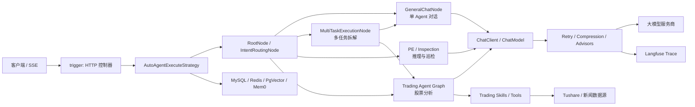

# AI Agent Study

这是一个基于 Spring Boot、Spring AI 和 Spring AI Alibaba 的多 Agent 学习项目。项目围绕“可落地的企业级 Agent”做了几条主线：统一意图路由、单 Agent 流式对话、多任务拆解、多 Agent 股票分析、模型重试与降级、会话记忆，以及基于 Langfuse 的 Trace 观测。

这份 README 主要面向本地运行、测试验证和面试演示。

## 项目亮点

- **统一入口**：通过 `POST /api/v1/agent/auto_agent` 接收通用对话、复杂任务、股票分析和巡检任务。
- **意图路由**：没有显式指定 `aiAgentId` 时，系统会识别用户意图并选择对应执行链路。
- **流式输出**：使用 SSE 返回执行进度和模型内容，适合演示 Agent 的中间过程。
- **多任务拆解**：复杂请求会被拆成多个子任务，分别执行后再汇总。
- **多 Agent 股票分析**：组合基本面、技术面、新闻、情绪和风险分析。
- **稳定性设计**：模型调用支持错误码识别、指数退避、最大重试次数、上下文压缩和降级。
- **可观测性**：执行过程生成 `traceId`，可将 trace、span、generation 和 score 写入 Langfuse。
- **测试分层**：默认测试不依赖真实云服务，在线模型和 OSS 测试统一放到 integration profile。

## 当前架构



## 模块说明

| 模块 | 说明 |
| --- | --- |
| `ai-agent-study-api` | HTTP DTO、VO 和服务接口 |
| `ai-agent-study-trigger` | Controller、SSE 入口和交易分析 HTTP 入口 |
| `ai-agent-study-domain` | Agent 编排、意图路由、重试、压缩、记忆和可观测性 |
| `ai-agent-study-infrastructure` | MySQL、Redis、Mem0、RAG、OSS 等基础设施适配 |
| `ai-agent-study-trading` | 股票分析 API、领域图、Skills 和行情数据工具 |
| `ai-agent-study-app` | Spring Boot 启动类和运行配置 |

## 本地运行

### 环境要求

- JDK 17
- Maven 3.9+
- Docker / Docker Compose
- MySQL、Redis、PgVector 等本地依赖
- 至少一个可用的大模型 API Key

### 启动依赖

```powershell
docker compose -f docs/dev-ops/docker-compose-redis-pgvector.yml up -d
```

### 设置环境变量

不要把真实密钥写回仓库。下面只展示本地 Shell 注入方式：

```powershell
$env:ZHIPU_API_KEY="..."
$env:DASHSCOPE_API_KEY="..."
$env:TUSHARE_TOKEN="..."
$env:MYSQL_URL="jdbc:mysql://localhost:3306/ai-agent-station?useSSL=false&serverTimezone=Asia/Shanghai"
$env:MYSQL_USER="..."
$env:MYSQL_PASSWORD="..."
```

可选集成：

```powershell
$env:DEEPSEEK_API_KEY="..."
$env:AI_DASHSCOPE_API_KEY="..."
$env:JD_CLOUD_OSS_ACCESS_KEY="..."
$env:JD_CLOUD_OSS_SECRET_KEY="..."
$env:LANGFUSE_ENABLED="true"
$env:LANGFUSE_HOST="..."
$env:LANGFUSE_PUBLIC_KEY="..."
$env:LANGFUSE_SECRET_KEY="..."
```

### 启动应用

```powershell
mvn -pl ai-agent-study-app -am spring-boot:run
```

应用默认监听：

```text
http://localhost:8090
```

主入口：

```text
POST /api/v1/agent/auto_agent
```

股票分析独立入口：

```text
POST /api/v1/trading/analysis
```

## 测试

默认测试只跑单元测试和离线测试，不访问真实云服务：

```powershell
mvn clean test
```

在线模型、OSS、外部服务和在线评测测试已统一命名为 `*IntegrationTest`，只在 integration profile 下执行：

```powershell
mvn -Pintegration verify
```

运行 integration profile 前，需要显式提供对应环境变量。缺少云凭据时，相关测试会跳过或在预检阶段给出明确提示。

## 面试演示

演示请求文件在 `docs/demo` 目录下。启动应用后可以按下面顺序演示。

### 1. 单 Agent 对话

```powershell
curl.exe -N -H "Content-Type: application/json" --data-binary "@docs/demo/single-chat.json" http://localhost:8090/api/v1/agent/auto_agent
```

建议讲解点：

- 统一入口接收用户消息。
- 通过 SSE 返回流式结果。
- `sessionId` 用于承接会话记忆和 Trace。

### 2. 多任务拆解

```powershell
curl.exe -N -H "Content-Type: application/json" --data-binary "@docs/demo/multi-task.json" http://localhost:8090/api/v1/agent/auto_agent
```

建议讲解点：

- 复杂问题会被拆成多个子任务。
- 子任务上下文隔离，避免互相污染。
- 最终结果由汇总节点统一生成。

### 3. 多 Agent 股票分析

面试时建议优先使用股票分析独立入口，结果更稳定：

```powershell
curl.exe -N -H "Content-Type: application/json" --data-binary "@docs/demo/trading-analysis.json" http://localhost:8090/api/v1/trading/analysis
```

如果要展示意图路由，可以使用统一 Agent 入口：

```powershell
curl.exe -N -H "Content-Type: application/json" --data-binary "@docs/demo/stock-analysis.json" http://localhost:8090/api/v1/agent/auto_agent
```

建议讲解点：

- Trading Graph 组织不同分析师节点。
- Skills 定义工具能力，基础设施层负责调用行情和新闻数据。
- 通过 `maxDebateRounds` 和 `maxRiskRounds` 控制演示时间。

### 4. 失败重试与降级

这部分建议用单元测试稳定演示：

```powershell
mvn -pl ai-agent-study-domain -Dtest="RetryChatModelTest,RetryChatModelCornerTest,RetryChatModelStreamTest" test
```

建议讲解点：

- 只对可重试错误执行重试。
- 最后一次失败后不再无意义 sleep。
- 流式调用异常时可以降级为安全返回。

### 5. Trace 展示

开启 Langfuse：

```powershell
$env:LANGFUSE_ENABLED="true"
```

演示时按 `traceId` 展示：

- trace 生命周期
- `chat_client_call` span
- 模型输入与输出
- 耗时、模型名和 token 信息
- 失败或降级时的错误元数据

完整演示脚本见 [docs/demo/README.md](docs/demo/README.md)。

## 安全说明

仓库曾提交过真实凭据。当前工作区已改为环境变量读取，但这不代表泄露过的密钥已经失效。

投递或公开仓库前必须完成：

1. 在对应平台轮换所有泄露过的密钥。
2. 清理 Git 历史中的旧凭据。
3. 确认 `.env`、本地配置和截图没有被提交。
4. 开启 secret scanning 或在提交前运行密钥扫描。

具体清单见 [docs/security/credential-rotation.md](docs/security/credential-rotation.md)。

## 当前验证状态

默认测试已通过：

```powershell
mvn clean test
```

最近一次验证结果：

- 11 个 Maven 模块全部成功。
- Retry / Flux 相关测试恢复到默认测试链路。
- 在线模型、OSS 和外部服务测试已拆到 integration profile。
- Demo JSON 均可被正常解析。

## 3 到 5 天收尾顺序

1. 第 1 天：轮换泄露过的全部凭据，清理 Git 历史，启用密钥扫描。
2. 第 2 天：保证 `mvn clean test` 稳定通过，处理明显慢测试和长期排除项。
3. 第 3 天：固定本地依赖、演示数据和演示请求，完整跑通一次演示。
4. 第 4 天：补 Trace 截图、失败注入说明和关键设计取舍。
5. 第 5 天：按 README 从空环境复跑，准备 5 分钟项目介绍和常见追问。

## 面试介绍建议

可以按下面这条线讲：

> 这个项目不是只调一个大模型接口，而是做了一套 Agent 执行框架：入口层负责接收 SSE 请求，领域层负责意图路由、任务拆解、模型调用、重试降级和 Trace，基础设施层负责连接数据库、向量库、记忆服务、OSS 和外部行情数据。股票分析是一个更完整的多 Agent 场景，用来展示工具调用、数据适配和多节点协作。
