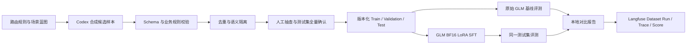

# GLM-4-9B 意图路由黑盒蒸馏设计

**日期：** 2026-06-19  
**状态：** 待评审  
**目标模型：** GLM-4-9B-Chat  
**训练方式：** BF16 LoRA SFT  
**教师数据来源：** Codex 生成、规则校验、人工复核  
**实验平台：** 本地文件为事实来源，Langfuse 用于数据集与实验可观测

## 1. 背景

当前系统已经具备统一意图路由能力，核心实现包括：

- `IntentRoutingNode`：接收当前请求与会话上下文，执行统一路由；
- `IntentRoutingService`：调用模型并解析结构化输出；
- `IntentRoutingPrompt`：定义意图边界、任务拆分、槽位与澄清规则；
- `IntentFewshotService`：从 PGvector 检索相似 Few-shot 样本；
- 本地结构评测集与在线路由评测集；
- Langfuse 服务，可承载后续 Dataset、Trace、Run 与 Score。

当前没有可直接用于监督微调的大规模真实业务请求，只能从合成数据冷启动。目标是在一张约 48 GB 显存的 AMD GPU、ROCm 7.2 环境中，对 GLM-4-9B-Chat 做 LoRA 微调，使其能够完整替代现有路由模型，同时降低推理成本与延迟。

本方案属于**基于合成数据与人工校验的黑盒知识蒸馏**：教师只提供最终响应，不提供 logits 或中间层表示；学生模型通过 SFT 学习教师生成的完整路由 JSON。

## 2. 目标与非目标

### 2.1 目标

1. 让 GLM-4-9B-Chat 输出符合当前统一路由协议的完整 JSON。
2. 支持单任务、多任务、任务依赖、槽位抽取和澄清判断。
3. 建立相互隔离的训练集、验证集和测试集。
4. 建立微调前后可复现、可追踪的对比实验。
5. 首轮以最小数据规模跑通数据生成、审核、训练、评测和记录闭环。
6. 保留 Few-shot 开关，通过消融实验区分微调、Prompt 与检索样本的贡献。

### 2.2 非目标

1. 首轮不进行全参数微调、QLoRA、DPO 或基于 logits 的白盒蒸馏。
2. 首轮不追求覆盖所有自然语言表达，而是验证流程与核心能力是否成立。
3. 首轮不自动将微调模型切换为生产默认模型。
4. 首轮不将 Langfuse 作为训练数据唯一存储；本地版本化文件仍是事实来源。
5. 首轮不重构现有意图路由业务代码或执行节点。

## 3. 路由能力边界

### 3.1 业务意图

训练和评测覆盖以下六类可执行意图：

| 意图 | 含义 | 典型边界 |
|---|---|---|
| `STOCK_ANALYSIS` | 股票、基金、期货、市场分析 | 标的名称可交给后续工具解析，不因缺少代码直接澄清 |
| `PE_REASONING` | 方案设计、根因分析、复杂推理与取舍 | 普通知识问答不应误判为推理 |
| `PE_CALCULATION` | 精确计算、统计与数据处理 | 只讨论公式概念时可归入通用对话 |
| `PE_RETRIEVAL` | 明确的知识库、RAG、多文档或外部资料检索 | 没有明确检索要求的概念问答不属于此类 |
| `INSPECTION` | 系统巡检与状态检查 | 与一般故障分析、知识问答区分 |
| `GENERAL_CHAT` | 闲聊、概念解释、普通问答、记忆和身份相关对话 | 无法归入专用执行器时的正常承接意图 |

`AMBIGUOUS` 不作为普通任务意图平均生成，而主要由 `needsClarification=true`、`missingInfo` 和 `clarificationPrompt` 表达。`UNKNOWN` 作为解析或系统兜底值，不作为主要训练类别。

### 3.2 输出能力

学生模型必须学习以下完整路由能力：

- `multiTask`；
- `needsClarification`；
- `reasoning`；
- `missingInfo`；
- `clarificationPrompt`；
- `taskList`；
- 每个任务的 `taskId`、顺序、内容、意图、执行节点、置信度与任务类型；
- `baseSlot` 与各意图专用槽位；
- 多任务的 `dependsOn` 有向依赖关系。

训练目标不是复述长篇推理过程，而是稳定生成简短、可审计的路由理由和合法结构。

## 4. 总体架构



数据生成、训练和评测相互解耦：生成器只产出候选样本；校验器决定样本是否可进入数据集；训练器只读取冻结后的训练与验证文件；评测器只读取冻结测试集，且测试标签不得进入训练 Prompt 或 Few-shot 库。

## 5. 数据集设计

### 5.1 首轮规模

| Split | 数量 | 用途 | 人工检查 |
|---|---:|---|---:|
| Train | 2,000 | LoRA 参数更新 | 50 条分层抽查 |
| Validation | 200 | 观察过拟合、选择 checkpoint 和参数 | 50 条分层抽查 |
| Test | 200 | 最终微调前后对比 | 200 条全量确认 |
| 合计 | 2,400 | 首轮最小闭环 | 300 条 |

首轮通过后，依据测试错误类型扩充至 8,000～10,000 条。扩充优先补充失败场景，不机械追求类别均匀。

### 5.2 样本结构

数据集保存两层结构：

1. **主记录格式**：用于审查、追踪、校验和评测；
2. **SFT 派生格式**：由主记录确定性转换为 GLM Chat Template 所需的 prompt/completion。

主记录至少包含：

```json
{
  "caseId": "train-retrieval-reasoning-dependent-0001",
  "split": "train",
  "scenarioFamily": "retrieval_then_reasoning",
  "difficulty": "hard",
  "input": {
    "query": "先查内部材料，再结合我们的业务给出选型建议",
    "historyMessages": []
  },
  "expected": {
    "multiTask": true,
    "needsClarification": false,
    "reasoning": "用户先要求检索资料，再基于资料完成方案推理",
    "missingInfo": [],
    "clarificationPrompt": "",
    "taskList": []
  },
  "metadata": {
    "generator": "codex",
    "schemaVersion": "intent-routing-v1",
    "reviewStatus": "generated",
    "tags": ["multi-task", "dependency", "boundary"]
  }
}
```

SFT 派生记录使用 `prompt + completion`：

- `prompt`：system 消息、最近会话历史、当前用户请求；
- `completion`：assistant 输出的紧凑合法 JSON；
- 训练只计算 completion token 的损失；
- 不在 completion 外加入 Markdown 代码块或解释文字。

### 5.3 场景覆盖

首轮数据至少覆盖：

1. 六类意图的典型单任务；
2. 容易混淆的相邻边界；
3. 两任务和三任务组合；
4. 独立并行任务与存在 `dependsOn` 的串行任务；
5. 信息充分与确实缺少关键信息的澄清场景；
6. 股票中文名、简称、代码、市场和时间范围等槽位变化；
7. 多轮短答、代词指代、任务修正和对上一轮的补充；
8. 口语、省略、错别字、标点噪声、中英文混输；
9. 极短输入、长输入和多个约束条件；
10. 与现有 Prompt 规则直接对应的回归场景。

### 5.4 数据隔离

禁止先生成大量近义句再随机拆分。正确流程是：

1. 先定义 `scenarioFamily`；
2. 按场景族分配 Train、Validation、Test；
3. 在各自 split 内独立生成表达变体；
4. 使用规范化文本哈希做精确去重；
5. 使用向量相似度做近义泄漏检查；
6. 对高相似跨 split 样本整组迁移或删除。

现有 `intent-routing-online-cases.json` 默认作为不可训练的外部回归基准，不进入 Train 和 Validation，也不进入在线 Few-shot 样本库。

## 6. 合成与审核流程

### 6.1 生成策略

Codex 根据场景蓝图分批生成主记录。每批只覆盖有限场景族，并显式约束数量、难度、语言风格、历史轮次和期望结构。训练集、验证集和测试集使用不同的生成批次与表达策略。

测试集不从训练样本直接改写。测试集生成时强调反例、边界歧义和组合泛化，并由人工逐条确认标签。

### 6.2 自动校验

候选样本进入数据集前必须通过：

- JSON 可解析；
- JSON Schema 校验；
- 意图和执行节点枚举合法；
- `taskId` 唯一；
- `taskIndex`、`totalTasks` 与任务数量一致；
- `dependsOn` 引用存在且无环；
- 澄清字段之间一致；
- 非澄清结果具备可执行任务；
- 意图专用槽位字段合法；
- 精确重复和近义泄漏检查；
- 训练完成后的最大序列长度统计。

自动校验只能证明结构成立，不能证明业务判断正确，因此不能替代人工复核。

### 6.3 人工复核

人工复核只需判断：输入与历史是否合理、意图是否正确、是否应澄清、任务拆分与依赖是否正确、槽位是否忠实于输入。

Train 和 Validation 使用分层抽样，确保每种意图、难度、多任务和澄清场景都被抽到。Test 全量复核。发现系统性错误时，不只修单条样本，而是修正生成规则并重新检查同场景族。

## 7. 训练设计

### 7.1 运行环境

- 单张 AMD GPU，显存约 48 GB；
- ROCm 7.2；
- PyTorch ROCm 版本，通过 `torch.cuda` 统一接口访问 GPU；
- ModelScope 下载 GLM-4-9B-Chat；
- Transformers、TRL、PEFT、Datasets 与 Accelerate；
- 不依赖 bitsandbytes。

### 7.2 LoRA 初始策略

- 权重精度：BF16；
- 训练方式：LoRA；
- Loss：completion only；
- 梯度检查点：开启；
- 初始 LoRA rank：16；
- 初始 LoRA alpha：32；
- 初始 dropout：0.05；
- 初始学习率：`1e-4`，根据验证结果调整；
- epoch：首轮分别保留 1、2、3 epoch checkpoint；
- 有效 batch size：从 8～16 起步；
- 最大长度：先统计真实 token 分布，再从 1024 起步调整；
- 优化器：`adamw_torch`。

LoRA `target_modules` 必须从 GLM 实际 `named_modules()` 探测并验证，不直接复用 Gemma Notebook 的 `all-linear`。训练开始前输出可训练参数名、数量和比例；若未命中预期文本层则立即停止。

### 7.3 Checkpoint 选择

训练期间记录训练损失和验证损失，但最终 checkpoint 不能只按最低 loss 选择。每个候选 checkpoint 需要在 Validation 上执行生成式评测，优先保证：

1. JSON 与 Schema 合法率；
2. 端到端任务完全匹配率；
3. 意图 Macro-F1；
4. 澄清 F1；
5. 任务依赖正确率。

若指标相近，选择更早、输出更稳定的 checkpoint，降低过拟合风险。

## 8. 评测与对比实验

### 8.1 固定实验组

在相同 Test、Chat Template、解码策略和最大输出长度下比较：

| 组别 | 模型 | Prompt | Few-shot | 目的 |
|---|---|---|---|---|
| A | 原始 GLM | 当前完整 Prompt | 开启 | 当前 GLM 可达到的上限基线 |
| B | 原始 GLM | 精简 Prompt | 关闭 | 测量裸模型能力与低成本基线 |
| C | 微调 GLM | 精简 Prompt | 关闭 | 测量微调本身的贡献 |
| D | 微调 GLM | 精简 Prompt | 开启 | 测量微调与检索样本叠加效果 |

如生产当前使用的不是 GLM，则额外保留“当前生产路由模型 + 当前 Prompt + Few-shot”作为业务参考组，但不与 GLM 的显存指标直接比较。

### 8.2 指标

必须记录：

- JSON 可解析率；
- Schema 合法率；
- 意图 Accuracy 与 Macro-F1；
- 任务数量准确率；
- 有序意图序列完全匹配率；
- 执行节点准确率；
- `needsClarification` Precision、Recall、F1；
- `missingInfo` 与澄清问题正确率；
- 各槽位字段准确率；
- `dependsOn` 图完全匹配率；
- 端到端路由完全匹配率；
- 重复运行一致率；
- P50/P95 延迟；
- 峰值显存、吞吐量和平均输出 token 数。

端到端完全匹配采用规范化后的结构比较：忽略无语义的 JSON 字段顺序和空白，但不忽略任务顺序、意图、执行节点、澄清和依赖关系。

### 8.3 可复现参数

每次实验保存：

- 基座模型 ID 与本地 revision；
- LoRA checkpoint 与配置；
- 数据集版本、文件哈希与 schemaVersion；
- Git commit；
- Prompt 版本；
- 随机种子；
- 训练与解码参数；
- Python、PyTorch、ROCm、Transformers、TRL 与 PEFT 版本；
- GPU 信息；
- 逐条原始输出、解析结果、错误类型与耗时。

## 9. Langfuse 集成

本地 JSONL、JSON 和 CSV 是首轮事实来源，避免 Langfuse 配置阻塞训练闭环。Langfuse 可用后执行：

1. 创建意图路由测试 Dataset；
2. 将每个冻结测试样本写为 Dataset Item；
3. 每个实验组和 checkpoint 创建独立 Dataset Run；
4. 每次推理写入 Trace，包含输入、原始输出、规范化结果、模型参数和延迟；
5. 将各评测指标写入 Score；
6. 在 Run metadata 中记录数据哈希、Git commit、Prompt 版本和 LoRA 配置。

接入时通过环境变量提供 Langfuse Host、Public Key 与 Secret Key。密钥不得写入 Notebook、数据集、Git 或实验报告。

## 10. 产物规划

后续实现阶段预计形成以下逻辑产物：

- 场景蓝图和生成批次配置；
- Train、Validation、Test 主记录；
- GLM SFT 派生 JSONL；
- Schema 与业务规则校验器；
- 数据去重和 split 泄漏报告；
- GLM 单卡 BF16 LoRA 训练脚本或 Notebook；
- 基线与微调生成式评测器；
- 本地逐条预测和聚合对比报告；
- Langfuse 同步与实验记录适配器；
- 数据审核说明和人工审核状态。

原有 `gemma4_emotion_lora_modelscope_single_gpu.ipynb` 仅作为流程参考，不直接修改为 GLM 路由训练脚本，避免模型专用逻辑和历史输出相互污染。

## 11. 异常处理与停止条件

### 11.1 数据异常

- 结构不合法：拒绝进入数据集并记录校验错误；
- 跨 split 高相似：整组迁移或删除，禁止只改几个字绕过去；
- 人工发现系统性误标：暂停该场景族，修正规则后重新生成；
- 样本超长：先分析来源，再决定裁剪、缩短 Prompt 或提高上下文长度，禁止静默截断 completion。

### 11.2 训练异常

- LoRA 未命中文本层：训练前失败；
- OOM：依次降低单卡 batch、提高梯度累积、缩短经验证可缩短的序列长度；
- Loss 为 NaN：保存环境与 batch 信息并停止，不继续产出不可比较 checkpoint；
- 验证损失下降但结构指标下降：不选择该 checkpoint；
- 输出大面积非法 JSON：优先检查 Chat Template、completion 边界和截断，再考虑补数据。

### 11.3 评测异常

- 推理失败与解析失败分别计数，不混入普通分类错误；
- 单条样本失败时保留原始响应和异常；
- 基础设施失败率超过 1% 时，该次 Run 不作为模型质量结论；
- 实验参数或测试集版本不一致时禁止直接比较。

## 12. 首轮验收标准

首轮的首要目标是验证完整闭环，而不是直接达到生产最优。满足以下条件视为 MVP 成功：

1. 2,400 条数据通过结构校验、去重与 split 隔离检查；
2. 300 条规定样本完成人工审核，Test 200 条全部确认；
3. 原始模型基线在训练前完成并保存逐条结果；
4. GLM-4-9B-Chat BF16 LoRA 在 ROCm 单卡环境完成至少一次训练；
5. LoRA adapter、训练参数、环境信息和 checkpoint 可重新加载；
6. 微调后模型在同一 Test 上完成评测；
7. 组 C 相对组 B 的 Schema 合法率、意图 Macro-F1 和端到端完全匹配率均不下降，其中至少一项有明确提升；
8. 本地报告能够逐条定位“修好、变坏、保持错误”的样本；
9. 所有实验均能通过数据哈希、Git commit 和配置追溯。

若首轮效果不足，不直接扩大数据规模。先按错误类别判断问题来自数据标签、场景覆盖、Prompt、截断、训练参数还是模型容量，再定向补充数据。

## 13. 后续阶段

### 阶段一：最小闭环

完成 2,400 条数据、基线、LoRA 训练、本地评测和对比报告。

### 阶段二：难例扩充

根据错误分析扩展至 8,000～10,000 条，重点补充边界、多轮、多任务依赖和澄清样本；必要时使用由简单到复杂的课程式 SFT。

### 阶段三：实验平台化

配置 Langfuse 凭证，上传冻结测试 Dataset，自动记录 Run、Trace 与 Score，使不同数据版本和 checkpoint 可长期比较。

### 阶段四：灰度接入

在不改变生产默认路由的前提下进行影子评测。达到生产门槛后，再决定是否直接替换、保留低置信回退，或继续使用 Few-shot 增强。

## 14. 关键决策汇总

1. 基座模型固定为 GLM-4-9B-Chat。
2. 采用 Codex 合成、规则校验和人工审核的黑盒响应蒸馏。
3. 首轮采用 BF16 LoRA SFT，不使用 QLoRA 或 DPO。
4. 学习完整统一路由 JSON，不只做单标签分类。
5. 首轮数据规模为 2,000/200/200，测试集全量人工确认。
6. 数据按场景族先切分后生成，避免语义泄漏。
7. 必须先跑原始模型基线，再执行训练。
8. 本地结果是事实来源，Langfuse 用于后续集中追踪。
9. 微调、Prompt 与 Few-shot 通过固定四组实验分别衡量。
10. 首轮成功后按错误驱动扩充，不盲目增加数据量。
