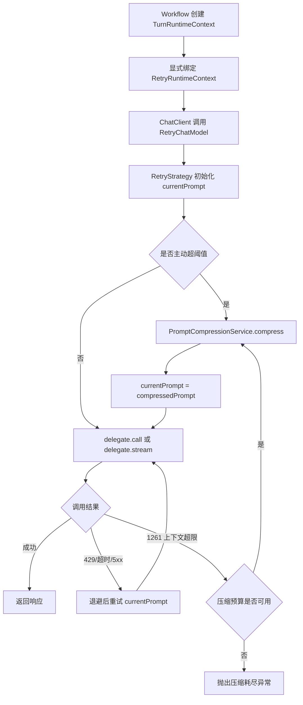

# Context Compression and Retry Refactor Implementation Plan

> **For agentic workers:** REQUIRED SUB-SKILL: Use superpowers:subagent-driven-development (recommended) or superpowers:executing-plans to implement this plan task-by-task. Steps use checkbox (`- [ ]`) syntax for tracking.

**Goal:** 将上下文压缩改造成 RetryChatModel 内部可闭环的重试能力，使主动超限和 1261 被动超限都能在压缩后使用同一 retry 会话再次调用原 LLM，同时解除 RetryChatModel 对装配期 DynamicContext 的运行时依赖。

**Architecture:** DB 中的 RetryConfig、CompressionConfig 继续作为模型装配配置，不迁移到 application.yml。retry 或 compression 任一启用时都装饰为 RetryChatModel；装配阶段只注入不可变策略和无状态 PromptCompressionService。每次 workflow 请求通过 RetryRuntimeContext 显式绑定 session/trace/history，RetryStrategy 使用 currentPrompt 驱动单一状态机，429 等瞬时错误重试当前 Prompt，1261 或主动阈值触发时生成 compressedPrompt、替换 currentPrompt 并继续同一状态机。

**Tech Stack:** Java 17、Spring Boot、Spring AI ChatClient/ChatModel、Project Reactor、Maven、JUnit 4/5、Mockito。

---

## 1. 现状与结论

当前链路存在一个确定的闭环缺口：

```text
RetryChatModel.call(originalPrompt)
  -> RetryStrategy 检测主动阈值或 1261
  -> 写 armory.factory.DynamicContext
  -> 抛 CompressionRequiredException
  -> CompressionContextNode 调压缩模型
  -> dynamicContext.setCompressedPrompt(compressedPrompt)
  -> 没有消费者再次调用原 LLM
```

`compressedPrompt` 目前只被写入和测试读取，没有生产代码消费它。因此现状不是“压缩后重试”，而是“压缩结果停留在装配上下文”。

本次改造采用以下边界：

- 保留 DB 配置来源。DB 与装配上下文不是问题根因，问题是 RetryChatModel 持有了可变、请求无关的 armory DynamicContext。
- 不合并 workflow DynamicContext 与 armory DynamicContext。前者是单请求运行态，后者是 Bean 装配态，生命周期不同。
- RetryChatModel 不再读取或修改 armory DynamicContext。
- 压缩后不从外层递归调用 `retryModel.call()`，而是在当前 RetryStrategy 中替换 `currentPrompt` 后继续循环，避免嵌套 retry 会话和预算重置。
- 429、超时、5xx 继续重试当前 Prompt；上下文超限才替换 Prompt。
- 普通错误重试和压缩恢复分别计数：RetryConfig.maxAttempts 控制初始调用加 429/超时/5xx 的普通尝试，maxCompressionAttempts 控制 Prompt 替换次数；二者在同一个 RetryStrategy 状态机中执行且都不重置。
- 同步和流式都覆盖；流式仅允许在尚未发出 chunk 时重试，避免客户端收到重复文本。
- retry 关闭但 compression 开启时仍创建 RetryChatModel，普通尝试预算固定为 1；主动压缩和 1261 压缩恢复仍然生效，但 429/5xx 不获得额外调用。

评估过但不采用的方案：

- 合并 workflow DynamicContext 与 armory DynamicContext：生命周期和并发模型不同，合并后会让动态注册的单例模型持有请求状态。
- 把 DB 配置整体迁移到 application.yml：只能改变配置来源，无法修复 compressedPrompt 没有消费者的问题，还会损失按模型动态配置能力。
- 压缩完成后从外层再次调用 `retryModel.call(compressedPrompt)`：会新建 retry 状态机并重置 maxAttempts，容易形成嵌套重试。
- 只新增 `retryModel.call(prompt, context)` 重载：直接调用模型时可用，但现有生产路径经过 ChatClient，ChatClient 不会调用自定义重载，因此不能单独解决问题。

## 2. 目标调用链



## 3. 文件结构

新增文件：

- `ai-agent-study-domain/src/main/java/denny/ai/agent/domain/model/valobj/runtime/RetryRuntimeContext.java`：只承载一次模型调用真正需要的 session、trace 和历史消息。
- `ai-agent-study-domain/src/main/java/denny/ai/agent/domain/service/runtime/RetryRuntimeContextHolder.java`：为 ChatClient 到 ChatModel 的固定接口提供显式调用作用域，并保证 finally 清理。
- `ai-agent-study-domain/src/main/java/denny/ai/agent/domain/service/armory/factory/element/CompressionPolicy.java`：装配期生成的不可变压缩策略。
- `ai-agent-study-domain/src/main/java/denny/ai/agent/domain/service/compression/PromptCompressionService.java`：压缩能力接口。
- `ai-agent-study-domain/src/main/java/denny/ai/agent/domain/service/compression/DefaultPromptCompressionService.java`：调用压缩模型、保留系统消息/当前用户消息/options 并生成新 Prompt。
- `ai-agent-study-domain/src/main/java/denny/ai/agent/domain/service/compression/CompressionExhaustedException.java`：压缩次数耗尽或压缩后仍超限的明确错误。

主要修改文件：

- `RetryStrategy.java`：变成以 `currentPrompt` 为核心的 retry + compression 状态机。
- `RetryChatModel.java`：移除 armory DynamicContext 字段，捕获调用期上下文，统一同步/流式决策。
- `AiClientModelNode.java`：只装配 RetryConfig、CompressionPolicy 和 PromptCompressionService，不注入可变 DynamicContext。
- `AutoAgentExecuteStrategy.java`：把已存在的 TurnRuntimeContext 映射为 RetryRuntimeContext，并在 handler 链执行期间显式绑定。
- `CompressionContextNode.java`：迁移完成后删除；其纯文本辅助逻辑移入 DefaultPromptCompressionService。
- `armory/factory/DynamicContext.java`：删除 compressionRequired、returnNode、originalPrompt、compressedPrompt 四个运行态字段。
- `CompressionRequiredException.java`：迁移完成后删除。

## 4. 接口约定

运行时上下文保持最小化：

```java
@Value
@Builder
public class RetryRuntimeContext {
    String sessionId;
    String traceId;
    boolean compressionCall;
    @Builder.Default
    List<ChatMessageEntity> recentMessages = List.of();

    public static RetryRuntimeContext from(TurnRuntimeContext turn) {
        SessionRuntimeContext session = turn.getSessionRuntimeContext();
        List<ChatMessageEntity> source = session == null
                ? List.of()
                : session.getRecentMessages();
        List<ChatMessageEntity> safeMessages = source == null
                ? List.of()
                : List.copyOf(source.stream()
                        .filter(Objects::nonNull)
                        .toList());
        return RetryRuntimeContext.builder()
                .sessionId(turn.getSessionId())
                .traceId(turn.getTraceId())
                .compressionCall(false)
                .recentMessages(safeMessages)
                .build();
    }

    public RetryRuntimeContext forCompressionCall() {
        return new RetryRuntimeContext(sessionId, traceId, true, recentMessages);
    }
}
```

装配策略保持不可变，不保存任何 session 数据：

```java
@Value
@Builder
public class CompressionPolicy {
    boolean enabled;
    String compressionModelId;
    int proactiveThresholdTokens;
    int maxCompressionAttempts;
    int maxSummaryTokens;
    String promptTemplate;
}
```

压缩接口显式接收原 Prompt、调用上下文和策略：

```java
public interface PromptCompressionService {
    Prompt compress(Prompt originalPrompt,
                    RetryRuntimeContext runtimeContext,
                    CompressionPolicy policy);
}
```

之所以增加 `RetryRuntimeContextHolder`，而不是只增加 `retryModel.call(prompt, context)`，是因为生产调用通过 `ChatClient` 完成，Spring AI 最终只会调用标准接口 `ChatModel.call(Prompt)` / `stream(Prompt)`，自定义重载无法被 ChatClient 调用。Holder 只作为这一层接口适配：workflow 在调用边界显式绑定，RetryChatModel 在方法入口立即捕获为局部变量，异步流不在后续线程重新读取 ThreadLocal。

## 5. 状态机规则

`RetryStrategy.execute` 必须遵循以下确定语义：

| 场景 | Prompt | 原模型 attempts | compressionAttempts | 退避 |
|---|---|---:|---:|---|
| 主动阈值超限 | 压缩后替换 | 压缩前不增加 | +1 | 不退避 |
| 429/超时/可重试 5xx | 保持当前值 | +1 | 不变 | 按 RetryConfig |
| 1261 且压缩启用 | 压缩后替换 | 失败调用已 +1 | +1 | 压缩成功后立即继续 |
| 1261 且压缩禁用 | 保持当前值 | +1 | 不变 | 立即失败，不进入普通 retry |
| 1261 且压缩预算耗尽 | 保持当前值 | +1 | 不变 | 抛 CompressionExhaustedException |
| 压缩后仍超过阈值 | 再次压缩或耗尽 | 不增加 | +1 | 不退避 |
| 压缩模型返回 1261 | 不调用原模型 | 不增加 | 当前次失败 | 转换为 CompressionExhaustedException |
| 压缩模型返回 429/超时/5xx | 不调用原模型 | 不增加 | 按实际调用增加 | 由压缩模型自身 RetryConfig 处理 |

防循环条件：

- `maxAttempts` 继续最大限制为 10。
- retry 未启用时，ordinaryAttemptsLimit 固定为 1，但压缩前置检查和 1261 专用分支仍执行。
- `maxCompressionAttempts` 必须至少归一化为 1，且最大限制为 3。
- `ordinaryRetriesRemaining = ordinaryAttemptsLimit - 1`；只有 429、超时和可重试 5xx 消耗它。1261 触发成功压缩后直接获得一次 replacement call，不消耗 ordinaryRetriesRemaining。
- 原模型调用总硬上限为 `ordinaryAttemptsLimit + maxCompressionAttempts`，防止配置或状态机错误导致无限调用；主动压缩发生在首次原模型调用之前，不额外占用 modelCalls。
- 新 Prompt 的 token 数必须小于旧 Prompt；否则立即抛 `CompressionExhaustedException`，不重复压缩相同内容。
- 1261 在压缩预算耗尽后抛出 `CompressionExhaustedException`，cause 保留最后一次 1261。
- 1261 是专用终止分支，优先于 retryable/nonRetryable 列表。它只能“压缩后继续”或“直接失败”，不得使用同一个过长 Prompt 做普通退避重试。
- DefaultPromptCompressionService 调用压缩 ChatClient 时使用 `runtimeContext.forCompressionCall()` 建立嵌套作用域。RetryChatModel 看到 `compressionCall=true` 时跳过主动/被动压缩，但仍处理 429、超时和 5xx；若压缩模型返回 1261，则由 DefaultPromptCompressionService 捕获并包装成 CompressionExhaustedException，cause 保留原始 1261。

## 6. Prompt 保真规则

DefaultPromptCompressionService 不得把整个 Prompt 简化成 `new Prompt(compressedText)`。新 Prompt 必须：

- 保留原 Prompt 的所有 SystemMessage。
- 保留最后一个 UserMessage 对象，包含多模态 media 和 metadata。
- 将历史摘要作为一条独立的 SystemMessage 插入 system 指令之后、当前用户消息之前。
- 对当前用户消息之后已经存在的 tool/assistant 消息保持原顺序，避免破坏工具调用闭环。
- 使用原 `Prompt.getOptions()` 构造新 Prompt，保留模型、温度、tool callbacks 等请求选项。
- 压缩输入优先使用 `RetryRuntimeContext.recentMessages`；没有 runtime context 时只压缩原 Prompt 中可识别的历史消息。
- 没有 runtime context 且无法识别可压缩历史时，不主动压缩，1261 路径抛出有明确原因的 CompressionExhaustedException。
- 构造压缩模型请求之前必须先预算 token。`compressionInputBudget = max(1, proactiveThresholdTokens - maxSummaryTokens - 1024)`，其中 1024 为模板、边界标签和响应协议预留；本阶段不新增 DB 字段。
- 模板和固定指令先计入预算，再从最新历史消息向前滚动加入；遇到预算不足时停止加入更旧消息。若单条最新历史消息已超预算，则按 TokenCountUtils 估算结果截断其 content，确保最终 compressionRequest 不超过 compressionInputBudget。
- 预算截断只能作用于送给压缩模型的历史副本，不能修改 RetryRuntimeContext.recentMessages 或 SessionRuntimeContext 中的原集合。

---

### Task 1: Characterization Tests for the Broken Chain

| Task | status |
|------|------|
| Task 1: Characterization Tests for the Broken Chain | pass |

**Files:**
- Modify: `ai-agent-study-domain/src/test/java/denny/ai/agent/domain/service/armory/RetryChatModelCompressionTest.java`
- Create: `ai-agent-study-domain/src/test/java/denny/ai/agent/domain/service/armory/CompressionRetryIntegrationTest.java`

- [ ] **Step 1: 添加一个当前必然失败的闭环测试**

```java
@Test
public void contextOverflowCompressesAndCallsDelegateAgain() {
    when(delegate.call(any(Prompt.class)))
            .thenThrow(new RuntimeException("{\"error\":{\"code\":\"1261\"}}"))
            .thenReturn(successResponse);

    ChatResponse response = retryChatModel.call(originalPrompt);

    assertSame(successResponse, response);
    verify(delegate, times(2)).call(promptCaptor.capture());
    assertNotEquals(promptCaptor.getAllValues().get(0), promptCaptor.getAllValues().get(1));
}
```

- [ ] **Step 2: 运行测试并确认失败原因是 CompressionRequiredException 或未发生第二次 delegate.call**

Run: `mvn -pl ai-agent-study-domain -am -Dtest=CompressionRetryIntegrationTest -Dsurefire.failIfNoSpecifiedTests=false test`

Expected: FAIL，且失败发生在现有压缩路由断点，而不是测试初始化错误。

- [ ] **Step 3: 固化 429 行为基线**

添加用例：第一次返回 429、第二次成功；断言两次 delegate 收到同一个 Prompt，且压缩服务未调用。

- [ ] **Step 4: 提交基线测试**

```bash
git add ai-agent-study-domain/src/test/java/denny/ai/agent/domain/service/armory
git commit -m "test: characterize compression retry gap"
```

### Task 2: Retry Runtime Context Scope

| Task | status |
|------|------|
| Task 2: Retry Runtime Context Scope | pass |

**Files:**
- Create: `ai-agent-study-domain/src/main/java/denny/ai/agent/domain/model/valobj/runtime/RetryRuntimeContext.java`
- Create: `ai-agent-study-domain/src/main/java/denny/ai/agent/domain/service/runtime/RetryRuntimeContextHolder.java`
- Create: `ai-agent-study-domain/src/test/java/denny/ai/agent/domain/service/runtime/RetryRuntimeContextHolderTest.java`

- [ ] **Step 1: 先写 holder 的清理、嵌套和线程隔离测试**

```java
@Test
public void scopeIsRemovedWhenSupplierThrows() {
    assertThrows(IllegalStateException.class, () ->
            RetryRuntimeContextHolder.withContext(context, () -> {
                assertSame(context, RetryRuntimeContextHolder.current());
                throw new IllegalStateException("boom");
            }));
    assertNull(RetryRuntimeContextHolder.current());
}
```

- [ ] **Step 2: 实现基于 `ThreadLocal<Deque<RetryRuntimeContext>>` 的作用域**

实现风格与现有 `ResponseValidationContext` 一致，提供 `withContext(context, supplier)`、`withContextThrowing(context, supplier)` 和 `current()`；finally 中 pop，空栈时 remove。嵌套绑定 `context.forCompressionCall()` 后，退出内层作用域必须恢复外层请求上下文。

- [ ] **Step 3: 实现 `RetryRuntimeContext.from(TurnRuntimeContext)`**

映射 sessionId、traceId 和 SessionRuntimeContext.recentMessages，不复制 flowConfigMap 或 emitter。recentMessages 必须先过滤 null 再使用 `List.copyOf(...)`，测试应在转换后修改 SessionRuntimeContext 原 List，并断言 RetryRuntimeContext 中的快照不变且不可写。

- [ ] **Step 4: 运行测试**

Run: `mvn -pl ai-agent-study-domain -am -Dtest=RetryRuntimeContextHolderTest -Dsurefire.failIfNoSpecifiedTests=false test`

Expected: PASS。

- [ ] **Step 5: 提交**

```bash
git add ai-agent-study-domain/src/main/java/denny/ai/agent/domain/model/valobj/runtime ai-agent-study-domain/src/main/java/denny/ai/agent/domain/service/runtime ai-agent-study-domain/src/test/java/denny/ai/agent/domain/service/runtime
git commit -m "feat: add retry runtime context scope"
```

### Task 3: Stateless Prompt Compression Service

| Task | status |
|------|------|
| Task 3: Stateless Prompt Compression Service | pass |

**Files:**
- Create: `ai-agent-study-domain/src/main/java/denny/ai/agent/domain/service/armory/factory/element/CompressionPolicy.java`
- Create: `ai-agent-study-domain/src/main/java/denny/ai/agent/domain/service/compression/PromptCompressionService.java`
- Create: `ai-agent-study-domain/src/main/java/denny/ai/agent/domain/service/compression/DefaultPromptCompressionService.java`
- Create: `ai-agent-study-domain/src/main/java/denny/ai/agent/domain/service/compression/CompressionExhaustedException.java`
- Create: `ai-agent-study-domain/src/test/java/denny/ai/agent/domain/service/compression/DefaultPromptCompressionServiceTest.java`

- [ ] **Step 1: 写 Prompt 保真测试**

构造包含 SystemMessage、历史 UserMessage、AssistantMessage、最后 UserMessage 和 ChatOptions 的 Prompt。mock 压缩 ChatClient 返回摘要，断言新 Prompt 保留 system、最后 user、options，移除旧历史并插入摘要。

同时构造超过 compressionInputBudget 的历史，断言发给压缩 ChatClient 的 request token 估算值不超过预算、优先保留最新消息、原 recentMessages 内容不变。

- [ ] **Step 2: 写运行态缺失测试**

当 runtimeContext 为 null 且 Prompt 只有一个当前 UserMessage 时，断言抛出 CompressionExhaustedException，消息包含 `no compressible history`。

- [ ] **Step 3: 迁移 CompressionContextNode 的纯函数**

把 summary 格式化、最近消息截取、compression request 构造和滚动截断迁入 DefaultPromptCompressionService；不要迁移 router、armory DynamicContext 或 CompressionRequiredException。

- [ ] **Step 4: 按兼容优先级解析压缩客户端**

优先获取现有完整 Bean `aiClientCOMPRESSION_ASSISTANTtaskType1`，保留其 DB system prompt、advisor、options 和其他 ChatClient 装配。完整 Bean 路径只发送历史 payload、摘要格式和 token 限制，不重复拼接 CompressionPolicy.promptTemplate。只有该 Bean 不存在时，才使用 `compressionModelId` 对应的 ChatModel 临时构建 ChatClient，并显式设置 `defaultSystem(policy.getPromptTemplate())` 以及 maxTokens=policy.maxSummaryTokens；解析失败抛出同时包含 beanName 和 modelId 的 IllegalStateException。

增加两条测试：完整 ChatClient Bean 存在时不解析 compressionModelId 且 system prompt 不重复；完整 Bean 缺失时使用 compressionModelId fallback，并验证 promptTemplate 与 maxSummaryTokens 已注入。

- [ ] **Step 5: 在 compressionCall 作用域调用压缩模型**

```java
RetryRuntimeContext compressionContext = runtimeContext.forCompressionCall();
String summary = RetryRuntimeContextHolder.withContext(compressionContext,
        () -> compressionClient.prompt(request).call().content());
```

增加测试：压缩模型内部可见 `compressionCall=true`，调用完成后恢复原 runtimeContext；压缩模型返回 429 时仍由它自己的 RetryConfig 处理。

- [ ] **Step 6: 将压缩模型 1261 转换为领域异常**

```java
try {
    return RetryRuntimeContextHolder.withContext(compressionContext,
            () -> compressionClient.prompt(request).call().content());
} catch (RuntimeException error) {
    if (AiErrorCodes.CONTEXT_OVERFLOW.equals(errorCodeExtractor.extract(error))) {
        throw new CompressionExhaustedException(
                "compression request exceeds compression model context window", error);
    }
    throw error;
}
```

测试断言异常类型为 CompressionExhaustedException、cause 是压缩模型原始 1261，且不会再次调用压缩服务。

- [ ] **Step 7: 运行测试**

Run: `mvn -pl ai-agent-study-domain -am -Dtest=DefaultPromptCompressionServiceTest -Dsurefire.failIfNoSpecifiedTests=false test`

Expected: PASS。

- [ ] **Step 8: 提交**

```bash
git add ai-agent-study-domain/src/main/java/denny/ai/agent/domain/service/compression ai-agent-study-domain/src/main/java/denny/ai/agent/domain/service/armory/factory/element/CompressionPolicy.java ai-agent-study-domain/src/test/java/denny/ai/agent/domain/service/compression
git commit -m "feat: extract stateless prompt compression service"
```

### Task 4: Single Retry and Compression State Machine

| Task | status |
|------|------|
| Task 4: Single Retry and Compression State Machine | append |

**Files:**
- Modify: `ai-agent-study-domain/src/main/java/denny/ai/agent/domain/service/armory/factory/element/RetryStrategy.java`
- Modify: `ai-agent-study-domain/src/test/java/denny/ai/agent/domain/service/armory/factory/element/RetryStrategyTest.java`

- [ ] **Step 1: 写状态机测试矩阵**

覆盖：主动压缩后首次调用成功；1261 后压缩并第二次成功；429 后同 Prompt 成功；429 后 1261 再压缩成功；压缩结果未缩短；压缩次数耗尽；ordinaryRetriesRemaining 不被压缩重置；compression disabled 时 1261 即使位于 retryableErrorCodes 也只调用 delegate 一次；retry disabled + compression enabled 时主动压缩后只调用原模型一次，被动 1261 时允许压缩后再调用一次。

- [ ] **Step 2: 修改构造参数**

```java
protected RetryStrategy(ChatModel delegate,
                        RetryConfig retryConfig,
                        CompressionPolicy compressionPolicy,
                        PromptCompressionService compressionService,
                        RetryRuntimeContext runtimeContext,
                        AiErrorCodeExtractor errorCodeExtractor)
```

- [ ] **Step 3: 将 execute 改为 currentPrompt 循环**

```java
Prompt currentPrompt = prompt;
int modelCalls = 0;
int compressionAttempts = 0;
int ordinaryRetriesRemaining = ordinaryAttemptsLimit - 1;
int maxModelCalls = ordinaryAttemptsLimit + maxCompressionAttempts;

if (shouldCompressProactively(currentPrompt)) {
    currentPrompt = compress(currentPrompt, ++compressionAttempts);
}

while (modelCalls < maxModelCalls) {
    modelCalls++;
    try {
        return doExecute(currentPrompt);
    } catch (Exception error) {
        String code = errorCodeExtractor.extract(error);
        if (isContextOverflow(code)) {
            if (canCompress(compressionAttempts)) {
                currentPrompt = compress(currentPrompt, ++compressionAttempts);
                continue;
            }
            throw contextOverflowFailure(error, compressionAttempts);
        }
        if (isOrdinaryRetryable(error, code) && ordinaryRetriesRemaining > 0) {
            ordinaryRetriesRemaining--;
            backoff();
            continue;
        }
        throw toRuntimeException(error);
    }
}
throw new IllegalStateException("model call safety limit exhausted");
```

实际实现中 `doExecute` 接收循环当前值；删除 `triggerCompression`、`checkPassiveCompression`、`onCompressionTriggered` 和 armory DynamicContext 字段。

- [ ] **Step 4: 验证 Prompt 和预算**

使用 ArgumentCaptor 断言 429 两次 Prompt 相同、1261 两次 Prompt 不同、压缩后成功时 delegate 总调用次数为 2，且不会新建第二个 RetryStrategy。额外断言 1261 禁用/耗尽分支不会进入 handleRetryOrRethrow。

- [ ] **Step 5: 运行测试**

Run: `mvn -pl ai-agent-study-domain -am -Dtest=RetryStrategyTest,CompressionRetryIntegrationTest -Dsurefire.failIfNoSpecifiedTests=false test`

Expected: PASS。

- [ ] **Step 6: 提交**

```bash
git add ai-agent-study-domain/src/main/java/denny/ai/agent/domain/service/armory/factory/element/RetryStrategy.java ai-agent-study-domain/src/test/java/denny/ai/agent/domain/service/armory
git commit -m "feat: retry compressed prompt in one state machine"
```

### Task 5: RetryChatModel and Assembly Decoupling

| Task | status |
|------|------|
| Task 5: RetryChatModel and Assembly Decoupling | append |

**Files:**
- Modify: `ai-agent-study-domain/src/main/java/denny/ai/agent/domain/service/armory/factory/element/RetryChatModel.java`
- Modify: `ai-agent-study-domain/src/main/java/denny/ai/agent/domain/service/armory/AiClientModelNode.java`
- Modify: `ai-agent-study-domain/src/test/java/denny/ai/agent/domain/service/armory/AiClientModelNodeRetryTest.java`
- Modify: `ai-agent-study-domain/src/test/java/denny/ai/agent/domain/service/armory/RetryChatModelCompressionTest.java`

- [ ] **Step 1: 写装配解耦测试**

断言 AiClientModelNode 创建 RetryChatModel 时只传 RetryConfig、CompressionPolicy 和 PromptCompressionService；不调用 setDynamicContext，且两个不同请求不会共享 compressionRequired 状态。参数化覆盖四种组合：retry/compression 都关闭时返回原模型；仅 retry 开启、仅 compression 开启、两者都开启时均返回 RetryChatModel。

- [ ] **Step 2: 改 RetryChatModel 构造器**

```java
public RetryChatModel(ChatModel delegate,
                      RetryConfig retryConfig,
                      CompressionPolicy compressionPolicy,
                      PromptCompressionService compressionService,
                      AiErrorCodeExtractor errorCodeExtractor)
```

保留现有两参数构造器用于“仅重试、不压缩”的调用和测试。删除 setCompressionConfig、setDynamicContext 及重复的同步压缩判断。

- [ ] **Step 3: 在 call 入口捕获上下文**

```java
@Override
public ChatResponse call(Prompt prompt) {
    RetryRuntimeContext context = RetryRuntimeContextHolder.current();
    return new CallRetryStrategy(context).execute(prompt);
}
```

- [ ] **Step 4: AiClientModelNode 构造不可变 CompressionPolicy**

从 DB 已加载的 CompressionConfig 和 systemPromptMap 构造策略；不把 armory DynamicContext 传给模型。DB JSON 结构和现有 modelVO 字段保持不变。

- [ ] **Step 5: 修正装饰器启用条件和单次调用语义**

```java
boolean retryEnabled = retryConfig != null && retryConfig.isEnabled();
boolean compressionEnabled = compressionConfig != null && compressionConfig.isEnabled();
if (!retryEnabled && !compressionEnabled) {
    return chatModel;
}

RetryConfig effectiveRetryConfig = retryEnabled
        ? retryConfig
        : RetryConfig.builder().enabled(false).maxAttempts(1).build();
return new RetryChatModel(chatModel, effectiveRetryConfig, compressionPolicy,
        promptCompressionService, new AiErrorCodeExtractor());
```

RetryStrategy 不能因为 `effectiveRetryConfig.enabled=false` 而绕过主动压缩检查和 1261 专用分支；它只应关闭 429/超时/5xx 的额外尝试，并将原模型调用次数限制为 1。

- [ ] **Step 6: 运行测试**

Run: `mvn -pl ai-agent-study-domain -am -Dtest=AiClientModelNodeRetryTest,RetryChatModelCompressionTest,RetryChatModelTest -Dsurefire.failIfNoSpecifiedTests=false test`

Expected: PASS。

- [ ] **Step 7: 提交**

```bash
git add ai-agent-study-domain/src/main/java/denny/ai/agent/domain/service/armory ai-agent-study-domain/src/test/java/denny/ai/agent/domain/service/armory
git commit -m "refactor: decouple retry model from armory context"
```

### Task 6: Bind Workflow Runtime Context Explicitly

| Task | status |
|------|------|
| Task 6: Bind Workflow Runtime Context Explicitly | append |

**Files:**
- Modify: `ai-agent-study-domain/src/main/java/denny/ai/agent/domain/service/auto/AutoAgentExecuteStrategy.java`
- Modify: `ai-agent-study-domain/src/test/java/denny/ai/agent/domain/service/auto/AutoAgentExecuteStrategyTest.java`

- [ ] **Step 1: 写 workflow 绑定和生命周期测试**

让 RuntimeContextAssembler 返回 TurnRuntimeContext，并在 mock executeHandler.apply 内断言 `RetryRuntimeContextHolder.current()` 包含相同 sessionId/traceId。分别覆盖 handler 成功与抛异常，断言 holder 最终清空、`runtimeContextAssembler.afterTurn(command, dynamicContext, turnContext)` 恰好调用一次，并且 afterTurn 执行时 holder 已为空。

- [ ] **Step 2: 使用 prepare 的返回值建立作用域**

```java
TurnRuntimeContext turnContext = runtimeContextAssembler.prepare(command, dynamicContext);
RetryRuntimeContext retryContext = RetryRuntimeContext.from(turnContext);

RetryRuntimeContextHolder.withContextThrowing(retryContext,
        () -> executeHandler.apply(command, dynamicContext));
```

不把 RetryRuntimeContext 写入 armory DynamicContext，不在 RetryChatModel 未参与时做任何额外 DB 查询。

- [ ] **Step 3: 使用 finally 调用 afterTurn**

```java
Exception executionFailure = null;
try {
    RetryRuntimeContextHolder.withContextThrowing(retryContext,
            () -> executeHandler.apply(command, dynamicContext));
} catch (Exception error) {
    executionFailure = error;
    throw error;
} finally {
    try {
        runtimeContextAssembler.afterTurn(command, dynamicContext, turnContext);
    } catch (RuntimeException cleanupError) {
        if (executionFailure != null) {
            executionFailure.addSuppressed(cleanupError);
        } else {
            throw cleanupError;
        }
    }
}
```

实现时保持 `execute` 的既有异常捕获边界：afterTurn 失败不能覆盖 handler 主异常；无主异常时 afterTurn 异常按执行异常处理。

- [ ] **Step 4: 验证同步和创建流时上下文可见**

GeneralChatNode 不需要逐个新增参数；ChatClient 调用 RetryChatModel.call/stream 时位于上述作用域内。RetryChatModel.stream 必须在方法入口捕获 context，后续 Flux 订阅只使用捕获的局部变量。

- [ ] **Step 5: 运行测试**

Run: `mvn -pl ai-agent-study-domain -am -Dtest=AutoAgentExecuteStrategyTest,RetryRuntimeContextHolderTest -Dsurefire.failIfNoSpecifiedTests=false test`

Expected: PASS。

- [ ] **Step 6: 提交**

```bash
git add ai-agent-study-domain/src/main/java/denny/ai/agent/domain/service/auto/AutoAgentExecuteStrategy.java ai-agent-study-domain/src/test/java/denny/ai/agent/domain/service/auto/AutoAgentExecuteStrategyTest.java
git commit -m "feat: bind retry context at workflow boundary"
```

### Task 7: Reactive Stream Retry and Compression

| Task | status |
|------|------|
| Task 7: Reactive Stream Retry and Compression | append |

**Files:**
- Modify: `ai-agent-study-domain/src/main/java/denny/ai/agent/domain/service/armory/factory/element/RetryChatModel.java`
- Modify: `ai-agent-study-domain/src/test/java/denny/ai/agent/domain/service/armory/factory/element/RetryChatModelStreamTest.java`

- [ ] **Step 1: 写订阅阶段错误测试**

delegate 返回 `Flux.error(429)` 后返回成功 Flux，断言订阅后发生第二次 delegate.stream；这条测试在现有实现下应失败，因为当前 while 只能捕获 Flux 创建阶段异常。

- [ ] **Step 2: 写流式压缩测试**

第一次 `Flux.error(1261)`，压缩服务返回 compressedPrompt，第二次返回成功响应；断言两次 Prompt 不同且 runtimeContext 是 stream 方法入口捕获的值。

- [ ] **Step 3: 写延迟订阅上下文捕获测试**

```java
Flux<ChatResponse> flux = RetryRuntimeContextHolder.withContext(runtimeContext,
        () -> retryChatModel.stream(originalPrompt));
assertNull(RetryRuntimeContextHolder.current());

StepVerifier.create(flux)
        .expectNext(successResponse)
        .verifyComplete();

verify(compressionService).compress(originalPrompt, runtimeContext, compressionPolicy);
```

该测试明确契约：Flux 可以在 context 作用域内创建、作用域退出后订阅；RetryChatModel.stream 必须在方法调用入口捕获 runtimeContext，`Flux.defer` 内禁止再次访问 RetryRuntimeContextHolder.current()。

- [ ] **Step 4: 使用 `Flux.defer` 实现每次订阅尝试**

每次尝试重新调用 delegate.stream(currentPrompt)，错误决策与同步状态机共享一个 RetryDecision helper；退避使用 `Mono.delay`，不得在 Reactor 线程调用 Thread.sleep。

- [ ] **Step 5: 防止部分输出重复**

每次流尝试记录是否已经发出 ChatResponse。若已发出至少一个 chunk 后再报错，直接传播错误，不执行 429 或 1261 重试；若尚未发出 chunk，则允许按预算重试或压缩。

- [ ] **Step 6: 删除主动超阈值时降级 call 的旧逻辑**

压缩完成后继续 `delegate.stream(compressedPrompt)`，保持调用者的流式契约，不再使用 `Flux.just(call(prompt))`。

- [ ] **Step 7: 运行测试**

Run: `mvn -pl ai-agent-study-domain -am -Dtest=RetryChatModelStreamTest -Dsurefire.failIfNoSpecifiedTests=false test`

Expected: PASS，且测试耗时不依赖真实 sleep。

- [ ] **Step 8: 提交**

```bash
git add ai-agent-study-domain/src/main/java/denny/ai/agent/domain/service/armory/factory/element/RetryChatModel.java ai-agent-study-domain/src/test/java/denny/ai/agent/domain/service/armory/factory/element/RetryChatModelStreamTest.java
git commit -m "feat: retry and compress reactive model streams"
```

### Task 8: Remove the Obsolete Armory Compression Route

| Task | status |
|------|------|
| Task 8: Remove the Obsolete Armory Compression Route | append |

**Files:**
- Delete: `ai-agent-study-domain/src/main/java/denny/ai/agent/domain/service/armory/CompressionContextNode.java`
- Delete: `ai-agent-study-domain/src/main/java/denny/ai/agent/domain/service/armory/CompressionRequiredException.java`
- Modify: `ai-agent-study-domain/src/main/java/denny/ai/agent/domain/service/armory/AiClientModelNode.java`
- Modify: `ai-agent-study-domain/src/main/java/denny/ai/agent/domain/service/armory/factory/DynamicContext.java`
- Delete: `ai-agent-study-domain/src/test/java/denny/ai/agent/domain/service/armory/CompressionRequiredExceptionTest.java`
- Delete: `ai-agent-study-domain/src/test/java/denny/ai/agent/domain/service/armory/DynamicContextCompressionTest.java`
- Modify: `ai-agent-study-domain/src/test/java/denny/ai/agent/domain/service/armory/CompressionContextHelperTest.java`

- [ ] **Step 1: 将 CompressionContextHelperTest 中仍有价值的纯函数用例迁到 DefaultPromptCompressionServiceTest**

保留摘要标签清洗、空消息、最近消息截断、压缩后仍超限等用例；删除 armory router 状态断言。

- [ ] **Step 2: 删除旧路由和异常**

AiClientModelNode.get 始终返回 aiClientAdvisorNode；删除 compressionContextNode 注入。DynamicContext 删除四个压缩运行态字段。

- [ ] **Step 3: 全仓确认无旧链路引用**

Run: `rg -n "CompressionRequiredException|CompressionContextNode|compressionRequired|originalPrompt|compressedPrompt|returnNode" ai-agent-study-domain/src`

Expected: 只允许新状态机局部变量 `compressedPrompt` 命中，不允许 armory DynamicContext 字段或旧异常命中。

- [ ] **Step 4: 提交**

```bash
git add -A ai-agent-study-domain/src/main/java/denny/ai/agent/domain/service/armory ai-agent-study-domain/src/test/java/denny/ai/agent/domain/service
git commit -m "refactor: remove armory compression routing state"
```

### Task 9: Regression Verification and Observability

| Task | status |
|------|------|
| Task 9: Regression Verification and Observability | append |

**Files:**
- Modify: `ai-agent-study-domain/src/main/java/denny/ai/agent/domain/service/armory/factory/element/RetryStrategy.java`
- Modify: `ai-agent-study-domain/src/main/java/denny/ai/agent/domain/service/compression/DefaultPromptCompressionService.java`
- Test: all retry, compression, runtime and auto workflow tests.

- [ ] **Step 1: 增加结构化日志字段**

每次原模型尝试记录 traceId、sessionId、modelCall/maxModelCalls、ordinaryRetriesRemaining、promptTokens、errorCode；每次压缩记录 compressionAttempt/maxCompressionAttempts、beforeTokens、afterTokens、trigger=proactive|1261。日志不得输出完整 Prompt 或摘要内容。

- [ ] **Step 2: 跑 retry/compression 专项测试**

Run: `mvn -pl ai-agent-study-domain -am -Dtest=RetryChatModelTest,RetryChatModelCompressionTest,RetryChatModelStreamTest,RetryStrategyTest,CompressionRetryIntegrationTest,DefaultPromptCompressionServiceTest,RetryRuntimeContextHolderTest,AiClientModelNodeRetryTest -Dsurefire.failIfNoSpecifiedTests=false test`

Expected: PASS。

- [ ] **Step 3: 跑 domain 全量测试**

Run: `mvn -pl ai-agent-study-domain -am test -Dsurefire.failIfNoSpecifiedTests=false`

Expected: BUILD SUCCESS；若存在与本改造无关的既有失败，记录测试类、失败信息和复现命令，不修改无关模块。

- [ ] **Step 4: 编译全项目**

Run: `mvn clean compile -DskipTests`

Expected: BUILD SUCCESS。

- [ ] **Step 5: 提交可观测性与回归调整**

```bash
git add ai-agent-study-domain
git commit -m "test: verify compression retry workflow"
```

## 7. 验收标准

- 主动阈值超限时，先压缩，再用 compressedPrompt 调用原模型。
- 原模型返回 1261 时，在同一个 RetryStrategy 实例内完成压缩与二次调用，不重置普通重试或压缩预算。
- 429、超时、5xx 不触发压缩，继续重试当前 Prompt。
- RetryChatModel 不再 import 或持有 `armory.factory.DynamicContext`。
- workflow DynamicContext 与 armory DynamicContext 不合并，二者没有新增相互引用。
- DB 中 RetryConfig/CompressionConfig 的读取与 JSON 结构保持不变，无 application.yml 迁移。
- 压缩后保留原 system 指令、当前用户消息、多模态内容和 Prompt options。
- 同一个 RetryChatModel Bean 被并发请求使用时，session/trace/history 不串线。
- 流式 1261/429 在首 chunk 前可恢复；首 chunk 后失败不自动重放。
- 旧 CompressionContextNode、CompressionRequiredException 和 armory 压缩状态字段全部移除。

## 8. 发布与回滚

建议按 Task 1-6 先完成同步链路并保持旧类尚未删除，专项测试通过后再完成 Task 7-8。不要让新旧两条压缩链路同时处理同一次异常：切换点是 RetryChatModel 不再抛 CompressionRequiredException。

回滚时以提交为单位逆序回退。DB 无 schema 和数据变更，application.yml 无新增配置，因此回滚不需要数据操作。上线后重点观察：1261 数量、压缩成功率、压缩前后 token 比、每请求原模型调用次数、CompressionExhaustedException 数量以及流式首 chunk 后错误率。
