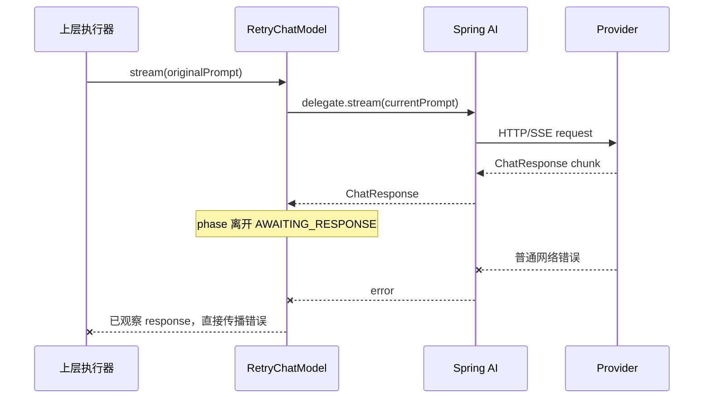
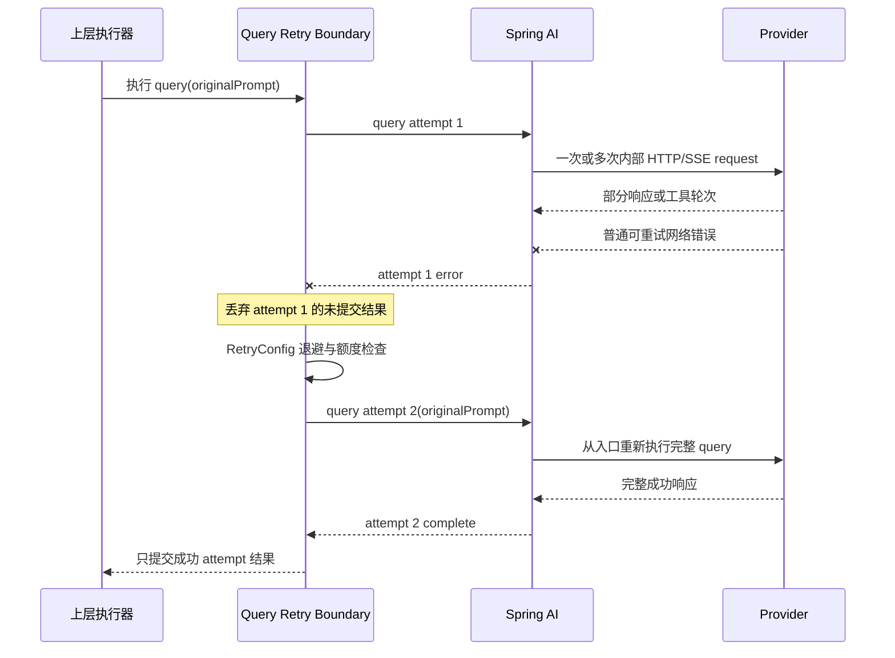

# Story 1：流式 LLM Query 重试开发执行文档

> **文档状态：** 开发、回归与编译验收已完成。

> **后续修订：** Story 3 `docs/superpowers/plans/2026-07-31-story-3-sse-timeout-query-retry-design.md` 在保留本 Story 基础退避公式的前提下，为 `RetryChatModel.stream()` 的实际等待增加 `0~1000ms` jitter；本文件记录 Story 1 完成时的历史基线。

**目标：** 让 `RetryChatModel` 以“整次 LLM query”为最小重试单位处理普通可重试错误；任何 attempt 在 `onComplete` 前都不向下游提交 chunk，失败时整轮丢弃并从原始 `Prompt` 重试。

**架构结论：** `RetryChatModel` 是唯一应用侧 stream retry owner。每个 delegate subscription 产生一个原子 query attempt：当前 attempt 的 `ChatResponse` 只做瞬时聚合，`onComplete` 后才按原顺序释放给下游；普通可重试 `onError` 时销毁全部临时结果并从原始 `Prompt` 重订阅。Story 1 不接入 timeout 重试；Story 2 允许把现有 timeout 观察点移动到原子聚合前，Story 3 再将 timeout 异常接入同一基础设施。

**技术栈：** Java、Spring AI 1.1.2、Project Reactor、JUnit 5、Mockito。

---

## 1. 决策记录

| 编号 | 已确认决策 | 影响 |
|------|------------|------|
| D-001 | 重试单位改为整次 LLM query | 不承诺只重放工具后的第 N 轮 HTTP request |
| D-002 | 不删除现有 timeout 能力 | Story 1 不新增或重试 timeout；为满足最终目标，Story 2 可以调整 operator 位置但保留配置与中断能力 |
| D-003 | 不实现 SSE 单事件或 chunk 续传 | 已接收的 SSE 数据不能作为断点继续请求 |
| D-004 | 不在 WebClient 增加原子 body 缓冲与 request replay filter | 删除旧方案中的 `StreamAttemptRetryFilter` 等组件设计 |
| D-005 | 工具执行采用 at-least-once 风险模型 | query 重试可能再次执行已经成功的工具；Story 1 不承诺 exactly-once |
| D-006 | 同步 `call()` 语义保持不变 | `RetryStrategy` 不做生产代码改造 |
| D-007 | timeout 按 Story 分层接入 | Story 2 让 timeout 在原子聚合前观察真实 chunk；Story 3 决定并接入 timeout retry |
| D-008 | 保持当前最终结果/异常语义 | 成功时只提交成功 attempt；全部耗尽时丢弃全部部分结果，只传播最后一次异常 |
| D-009 | stream 使用安全优先错误分类 | hard exclusion 与 `nonRetryableErrorCodes` 优先；真实 HTTP 状态优先于 provider code；配置不得突破 Story 1 范围 |
| D-010 | Spring AI 终止信号是唯一依据 | delegate `complete` 按成功、`error` 按错误处理；Story 1 不解析 `[DONE]`，无异常 EOF 不触发重试 |
| D-011 | 不保留 query attempt | attempt 只是瞬时执行生命周期；终止后不保存响应、history、HTTP/SSE 对象或 attempt 档案 |
| D-012 | 统一采用 `RetryConfig` 退避 | 不读取 `Retry-After`；`initialIntervalMs/multiplier/maxIntervalMs` 是退避参数，不是 stream timeout |
| D-013 | 用订阅生命周期验收资源释放 | 通过 subscribe/cancel/`doFinally` 计数与 Reactor 虚拟时间断言，不使用 GC、堆快照或 WebClient 内部 buffer 检查 |
| D-014 | `RetryChatModel` 保持唯一 stream retry owner | 不把 retry 移到 collector、WebClient 或调用节点，避免配置传递和重复 retry |
| D-015 | query attempt 后端原子提交 | 当前 attempt 的 `ChatResponse` 在 `onComplete` 前不可见；error/timeout 时整轮丢弃，不保留历史 attempt |
| D-016 | 预算只统计应用层 LLM query | `maxAttempts` 统计 `RetryChatModel` 创建的完整 query subscription；工具 HTTP 轮次和 Provider 内部行为不消耗 credit |

## 2. 当前实现与问题

生产链路：

```text
RetryChatModel(OpenAiChatModel)
  -> OpenAiApi
  -> WebClient
  -> OpenAI-compatible Provider
```

本地代码依据：

| 文件 | 当前事实 |
|------|----------|
| `RetryChatModel.java:68-79` | `stream()` 捕获 runtime context、创建 `StreamState`，并在最外层应用 `totalTimeout` |
| `RetryChatModel.java:81-140` | 每次 `streamAttempt()` 调用 `delegate.stream(state.currentPrompt)`，应用 first-content/idle timeout 后分类重试 |
| `RetryChatModel.java:109-112` | 一旦观察到任意 `ChatResponse`，当前代码直接传播后续错误，不再普通重试 |
| `RetryChatModel.java:126-137` | 压缩或普通错误恢复会递归执行 `streamAttempt(state)` |
| `RetryChatModel.java:178-188` | 每次订阅共享普通重试次数、压缩次数、模型调用上限和退避序号 |
| `AiClientModelNode.java:94-112` | `RetryConfig` 和 `StreamingTimeoutConfig` 一并装配到 `RetryChatModel` |
| `AiClientApiNode.java:42-51` | `OpenAiApi` 使用共享的 `WebClient.Builder` |
| `AiClientHttpTimeoutConfig.java:40-49` | WebClient 仅配置 JDK connect timeout，没有当前 request 重放能力 |
| `StreamingChatResponseCollector.java:24-59` | chunk 写入本地 `StringBuilder`；终止错误向上抛出，finally 清空当前结果 |

Spring AI 1.1.2 的 `OpenAiChatModel.internalStream()` 在工具执行后用 `conversationHistory()` 生成新 `Prompt` 并递归调用自身。外层 `RetryChatModel` 只持有入口 `Prompt`，无法取得并重放内部第 N 轮 `Prompt`。

因此，本 Story 接受能力降级：普通网络错误触发重试时，从入口 `Prompt` 重跑整次 query，而不是在 Spring AI 内部轮次或 SSE 字节位置恢复。

## 3. 改造前后流程

### 3.1 改造前



当前只在尚未观察任何 `ChatResponse` 时重试。这样避免了失败 attempt 的部分输出与 retry 输出拼接，但 response body 中途 I/O 断开不会重试。

### 3.2 改造后目标



工具调用属于完整 query 的内部副作用。attempt 1 已执行过的工具，在 attempt 2 可能再次执行。

## 4. 精确范围

### 4.1 目标

- 以下普通错误允许触发整次 query 重试：
  - connect error；
  - connection reset；
  - 响应头读取失败；
  - HTTP `429`；
  - HTTP `500/502/503/504`；
  - response body I/O 中断。
- 复用 `RetryConfig` 的启用开关、最大尝试次数、退避参数和错误码 veto 策略。
- 每次 `stream()` 订阅拥有独立的 query attempt 状态和重试预算。
- 同一订阅内所有 query attempt 使用同一个原始/压缩后的入口 `Prompt` 状态。
- 跨 attempt 只保留原始输入、当前序号、剩余额度、退避状态、取消状态和最后一次异常，不保存历史 attempt。
- 失败 attempt 的部分内容不能与成功 attempt 的内容拼接。
- 当前 attempt 的任何 `ChatResponse` 在该 attempt `onComplete` 前不能到达下游 subscriber。
- 最终只向当前后端调用提交一次成功结果；若全部失败则向上游传播终止异常。
- cancel、退避取消、attempt error 和 complete 后不保留活动订阅或计时任务。

### 4.2 非目标

- 不重放 Spring AI 内部当前第 N 轮 HTTP request。
- 不实现 SSE 单事件、单 chunk、字节偏移或 `Last-Event-ID` 续传。
- 不保证工具只执行一次，不新增工具幂等、结果持久化或补偿框架。
- Story 1 不新增 timeout 类型，不在本 Story 将 timeout 判为可重试。
- 不讨论 Story 2 的 first-event、raw-idle、stall/chunk timeout 新设计。
- 不把任何 timeout 异常接入普通重试；该分类属于 Story 3。
- 不修改同步 `call()`、`RetryStrategy` 和同步压缩恢复语义。
- 不在 `WebClient` 实现 `ClientRequest` replay、SSE body 原子缓冲或 `[DONE]` 判定。
- 不识别“缺少 `[DONE]` 但 Spring AI 正常 complete”的静默截断；该场景按正常完成处理。

### 4.3 最终结果与异常契约

- query attempt 成功完成时，只允许提交该成功 attempt 的完整结果。
- query attempt 在产生部分 chunk 后失败时，该 attempt 的文本、tool-call delta 和 metadata 都不得进入最终结果。
- 后续 attempt 成功时，上层只看到成功 attempt 的结果，看不到此前失败 attempt 的部分内容或错误。
- 所有 attempt 耗尽时，上层只收到最后一次 attempt 的终止异常；不返回部分结果，不把部分结果包装成成功，不合并为 first/composite error。
- 最后一次异常应尽量保持原始异常类型、message 和 cause chain；只允许 Reactor 已有的 unwrap 行为，不新增 Story 1 专用包装异常。
- `RetryChatModel` 只向下游释放成功 attempt，因此 `StreamingChatResponseCollector` 无需识别 attempt reset，继续维持现有最终文本聚合语义。
- delegate 正常发出 `complete` 时，即使上层无法观察到 raw SSE `[DONE]`，也必须按成功处理，不得因为推测缺少终止标记而重试。

### 4.4 Attempt 生命周期与留存契约

- `attempt` 只是一次完整 query 执行的术语和序号，不是需要持久化或归档的领域对象。
- 禁止维护 `List<Attempt>`、失败响应快照、raw SSE/body、失败轮次 conversation history、tool-call delta 或 HTTP request/response 引用。
- 当前 attempt 为等待 `onComplete/onError` 所需的 `ChatResponse` 瞬时聚合由 `RetryChatModel` 管理；它不属于跨 attempt 留存。
- 当前 attempt 收到 `onError` 或 cancel 后，瞬时内容立即清空，再创建全新的 query attempt。
- 当前 attempt 收到 `onComplete` 后，按原顺序释放该 attempt 的 `ChatResponse`；下游保持现有字符串聚合，attempt 临时容器随后释放。
- 前序错误只记录 `attemptNumber`、耗时、chunk 数、部分长度、error type/code 等元数据，不记录完整响应正文。

## 5. Timeout 跨 Story 契约

Story 1 的边界：

- 不删除 `StreamingTimeoutConfig`、`AiStreamingProperties.StreamingTimeouts` 或现有 timeout 配置来源。
- timeout 异常仍向上游传播，Story 1 classifier 必须判为不可重试。
- Story 1 的普通网络错误原子重试基础设施不得引用 Story 2/3 新 timeout 类型。
- `AiStreamingProperties.StreamingTimeouts` 构造与 `AiClientModelNode` 装配保持兼容。

后续接入契约：

- Story 2 将 first-content、idle、total timeout 的观察点放在 attempt 原子聚合之前，使 timer 能看到真实 chunk，不因后端暂存而误判无信号。
- Story 2 保留既有配置值、取消能力和异常传播，不删除 timeout。
- Story 3 将选定的 timeout 异常交给同一个 query retry classifier；timeout 后丢弃当前 attempt，再从原始 `Prompt` 重试。
- Story 3 不得另建第二套 retry budget、backoff 或 attempt 历史。

## 6. RetryConfig 复用原则

本 Story 复用的是 `RetryConfig` 策略，不把 `RetryChatModel.stream(prompt)` 入口本身当作可嵌套复用的 retry primitive。

| 配置 | Story 1 语义 |
|------|--------------|
| `enabled` | 是否允许普通 query retry；`false` 时只有一次 query attempt |
| `maxAttempts` | 整次 query 的总尝试次数，继续裁剪到安全范围 `1..10` |
| `initialIntervalMs` | 第一次 retry 前退避 |
| `multiplier` | 后续 retry 退避倍率，非正数按 `1.0` |
| `maxIntervalMs` | 单次退避上限 |
| `retryableErrorCodes` | 只在本 Story 固定普通错误集合内补充 provider error code 命中，不能推翻 hard exclusion、veto 或可靠 HTTP 状态 |
| `nonRetryableErrorCodes` | 一票否决；任一已识别 raw/normalized/provider/HTTP code 命中后不重试 |

一次订阅只创建一份预算：

```text
maxAttempts = N
首次 query attempt = 1
可用 retry credit = N - 1
每次真正调度下一 query attempt 时消耗 1 个 credit
```

计数边界：

- 一个 `RetryChatModel` query attempt 可以包含 Spring AI 工具递归产生的多个 HTTP/SSE request。
- 工具前后的 HTTP 轮次是同一应用层 LLM query attempt，不递增 attempt 序号，不消耗 retry credit。
- Provider 服务端内部是否重试不可观察，不纳入本地预算或验收计数。
- Spring AI 1.1.2 的 `internalStream()` 当前直接调用 `chatCompletionStream()`，不使用 builder 的同步 `RetryTemplate`；契约测试锁定这一事实。
- 同步 `call()` 的 Spring Retry 与项目 `RetryStrategy` 保持现状，本 Story 不修改或重新计数。

Story 1 不引入跨 Spring AI 工具轮次的 Reactor Context 预算，因为工具轮次不再是可见的重试边界。

### 6.1 退避来源与 timeout 分离

- Story 1 不读取、解析或传播 Provider `Retry-After` header。
- 每次 query retry 的等待时间只由 `RetryConfig.initialIntervalMs`、`multiplier` 和 `maxIntervalMs` 计算。
- `RetryConfig.maxAttempts` 与上述三个字段属于 attempt 数量和退避控制，不属于请求或 stream timeout。
- first-content、idle、total timeout 继续由 `StreamingTimeoutConfig` 和 `AiStreamingProperties.StreamingTimeouts` 独立管理。
- 不删除 `RetryConfig` 退避字段，也不把它们迁移到 timeout 配置。
- 即使异常 message 或可见 metadata 中包含 `Retry-After`，Story 1 也必须忽略并按本地退避执行。

### 6.2 Stream 错误分类优先级

stream 必须按以下顺序得出唯一结论；该规则不修改同步 `call()`：

1. timeout、用户取消、SSE/JSON decode、工具执行和业务校验错误属于 hard exclusion，直接不重试。
2. 收集 cause chain 中可识别的 raw provider code、normalized code 和 HTTP code；任一命中 `nonRetryableErrorCodes` 时直接不重试。
3. 存在可靠、结构化的实际 HTTP status 时以其为准：只允许 `429/500/502/503/504`，其他状态不重试。
4. 没有可靠 HTTP status 时，provider body code 才可作为回退；仅当其本身或规范化结果落入 Story 1 固定错误集合时可重试。
5. 没有 status/code 结论时，connect error、connection reset、响应头失败和 response body I/O 中断可通过异常类型与 cause chain 判为可重试。
6. 其余情况全部不重试；`retryableErrorCodes` 不能把 timeout、其他 4xx、decode、工具或业务错误扩展为可重试。

冲突示例：

| 输入 | 结论 | 原因 |
|------|------|------|
| `TimeoutException` 的 message 含 `429` | 不重试 | hard exclusion 优先 |
| 实际 HTTP `400`，body code 为 `rate_limit_exceeded` | 不重试 | 可靠 HTTP status 优先于 provider code |
| 实际 HTTP `429`，body code 为其他值 | 重试 | 可靠 HTTP status 命中固定范围；若任一 code 被 veto 则仍不重试 |
| 无 HTTP status，provider code 规范化为 `429` | 重试 | provider code 作为回退且落入固定范围 |
| connect reset，无 status/code | 重试 | ordinary transport cause chain 命中 |

现有 `AiErrorCodeExtractor.extract()` 只返回一个 code，且顺序为 provider body code、异常类名、HTTP code。Story 1 的 stream classifier 不得直接依赖这个“单 code 即最终结论”的语义；实现应保留同步路径兼容，同时为 stream 提供足以执行上述优先级的分类结果。

## 7. 方案比较

### 采用方案：`RetryChatModel` 内部原子 query attempt

在 `RetryChatModel.stream()` 中为每次完整 delegate subscription 建立 query attempt，attempt 完整成功后才提交结果；失败时丢弃该 attempt 并按 `RetryConfig` 重订阅原始 `Prompt`。

- 优点：重试策略仍由模型装饰器统一管理，调用方无感。
- 影响：下游只能在 attempt 完整成功后看到 chunk；这符合后端完成后一次性提交的生产要求。
- timeout 处理：Story 2 把观察点放到原子聚合前，Story 3 再接入 retry。

### 放弃方案：在最终聚合边界重试完整 query

让一次 `StreamingChatResponseCollector.collect()` 对应一个 query attempt；失败后清空本次结果，再由上层重新创建并收集 query。

- 放弃原因：`RetryConfig` 只由模型装饰器持有，迁移 owner 会扩大调用契约，并与现有 `RetryChatModel` ordinary retry 叠加。

### 方案 C：WebClient 当前 request 重放

在 `ExchangeFilterFunction` 中重放同一个 `ClientRequest` 并原子缓存 body。

- 优点：理论上可以避免重跑已完成工具。
- 结论：本轮明确放弃。Spring AI 已封装 SSE 解码和工具递归，项目当前不拥有足够的底层状态；该方案还会引入大响应内存、EOF/[DONE]、DataBuffer 释放和 timeout 迁移问题。

最终选择为 `RetryChatModel` 内部原子 query attempt；方案 B/C 均不得在 Story 1 实现。

## 8. 文件职责

| 文件 | Story 1 职责 |
|------|--------------|
| `RetryChatModel.java` | 唯一 stream retry owner；每 attempt 瞬时聚合 `ChatResponse`，成功后释放、失败后丢弃；保留同步 call 与压缩 |
| `StreamingChatResponseCollector.java` | 保持最终文本聚合，不感知 attempt、不执行 retry、不保存失败 attempt |
| `GeneralChatNode.java` | 兼容核验：经 `RetryChatModel` 后只能在成功 attempt 完成后收到 chunk，不再承诺模型生成中的逐 token 可见性 |
| `AiClientModelNode.java` | 继续装配同一份 `RetryConfig`、压缩配置和 timeout 配置 |
| `AiClientApiNode.java` | 只做兼容核验，不增加 request replay 状态 |
| `AiClientHttpTimeoutConfig.java` | 保持 connect timeout 配置，不安装 retry filter |

不再新增：

- `StreamAttemptRetryPolicy`
- `StreamAttemptRetryContext`
- `StreamAttemptErrorClassifier`
- `StreamAttemptRetryFilter`
- WebClient 原子 SSE body buffer

## 9. `RetryChatModel.stream()` 保留与移除

保留：

- `Flux.defer` 的每订阅 `StreamState`；
- `RetryRuntimeContext` 捕获；
- 主动压缩和 `1261` 压缩恢复；
- `RetryConfig` 预算与退避；
- timeout 配置与构造契约；具体观察位置由 Story 2 调整；
- 取消传播和模型调用安全上限。

移除或替换：

- “观察到任意 `ChatResponse` 后所有普通错误一律禁止重试”的旧限制；
- 会把失败 attempt chunk 直接暴露给同一次最终聚合的递归拼接路径。

新增：

- subscription-local 的当前 attempt `ChatResponse` 瞬时容器；
- 仅在 `onComplete` 后执行 `Flux.fromIterable(successfulAttemptResponses)` 或等价释放；
- error/cancel 时清空当前容器，重试时创建全新容器。

不得加入：

- WebClient request replay；
- Reactor Context 共享工具轮次预算；
- SSE timeout classifier；
- Story 2 的新 timeout operator。

## 10. 可靠性约束

- query retry 是 at-least-once：Provider 可能已经接收失败 attempt 的 POST，工具也可能已执行。
- 重试耗尽只传播最后一次终止异常，前序异常仅可进入结构化日志，不改变上层异常类型，也不得携带失败 attempt 的响应内容。
- 有副作用的工具应由业务侧自行提供幂等键或可重复执行语义；Story 1 只记录风险，不建设通用框架。
- query attempt 必须订阅串行执行，前一 attempt 终止并释放后才能启动下一 attempt。
- 不保存历史 attempt；前一 attempt 终止后只允许留下日志元数据，控制状态推进到下一序号。
- cancel 发生在响应、退避或重试准备阶段时，不得再创建下一 attempt。
- 最大尝试次数继续限制为 10，避免无限重试和请求风暴。
- 不叠加 Spring AI/Provider SDK 的隐藏重试；测试以实际 HTTP 请求数或 delegate 订阅数校验总放大倍数。
- `RetryChatModel` 是唯一应用侧 stream retry owner；collector 和调用节点不得再次 `retryWhen` 或循环重订阅。
- `RetryConfig.maxAttempts` 统计 query subscription，不统计物理 HTTP 请求；测试必须区分无工具 query 与多工具轮次 query。
- HTTP `Retry-After` 没有稳定的上层透传契约且本轮决定不支持；所有 retry 统一使用 `RetryConfig` 本地退避。
- raw SSE `[DONE]` 已由 Spring AI/OpenAiApi 封装；Story 1 只消费 delegate 的 `complete/error`。没有异常的 EOF 即使理论上可能是静默截断，也不进入普通错误分类。

### 10.1 资源释放的可观测验收

- 测试 publisher 用原子计数器记录 subscribe、cancel、complete/error `doFinally` 和当前 active subscription 数。
- retry 必须串行：attempt N 的 `doFinally(ERROR)` 已发生且 active 数归零后，attempt N+1 才能 subscribe。
- active attempt 被下游 cancel 时，上游 cancel 恰好一次、active 数归零且不产生下一 attempt。
- backoff 中 cancel 时，使用 `StepVerifier.withVirtualTime` 推进超过所有退避时间，仍不得新增 subscription。
- complete、error、cancel 三种终止路径结束后，active subscription 数都必须为零。
- 不通过 `System.gc()`、弱引用回收时机、堆快照或线程睡眠推断资源释放。
- Story 1 不拥有 WebClient `DataBuffer`，因此不检查或手动释放其内部 buffer；HTTP 集成测试只断言请求次数、取消传播和无额外请求。

## 11. 开发任务

> 只有架构评审全部通过后才执行以下任务。

### 任务 1：锁定 Story 边界与同步语义

| 任务 | status |
|------|--------|
| 任务 1：锁定 Story 边界与同步语义 | pass |

**文件：**

- 测试：`ai-agent-study-domain/src/test/java/denny/ai/agent/domain/service/armory/factory/element/RetryChatModelStreamTest.java`
- 测试：`ai-agent-study-domain/src/test/java/denny/ai/agent/domain/service/armory/factory/element/RetryStrategyTest.java`

- [x] 锁定现有 timeout 配置、异常类型与取消回归；精确观察点迁移留给 Story 2。
- [x] 运行同步 `call()`、压缩和 runtime context 现有测试，记录基线。
- [x] 断言 Story 1 普通错误分类不接受 timeout。

### 任务 2：实现 query attempt 状态与错误分类

| 任务 | status |
|------|--------|
| 任务 2：实现 query attempt 状态与错误分类 | pass |

**文件：**

- 创建：`ai-agent-study-domain/src/main/java/denny/ai/agent/domain/service/armory/factory/element/StreamQueryRetryClassifier.java`
- 创建：`ai-agent-study-domain/src/test/java/denny/ai/agent/domain/service/armory/factory/element/StreamQueryRetryClassifierTest.java`
- 修改：`ai-agent-study-domain/src/main/java/denny/ai/agent/domain/service/armory/factory/element/RetryChatModel.java`

- [x] 先写 connect、reset、响应头失败、`429`、目标 5xx、body I/O 中断的失败测试。
- [x] 写错误冲突矩阵测试，覆盖 hard exclusion、veto、可靠 HTTP status、provider fallback 和 transport cause chain 的顺序。
- [x] 写异常信息含 `Retry-After` 的虚拟时间测试，断言实际等待仍严格等于 `RetryConfig` 计算值。
- [x] 复用 `RetryConfig` 快照创建每订阅预算和退避状态。
- [x] 保证 `nonRetryableErrorCodes` 对 raw/normalized/provider/HTTP code 均可 veto，并先于 status、普通类型与 retryable code 判断。
- [x] 明确排除 timeout、decode error、工具错误、业务错误和 cancel。

### 任务 3：实现失败 query attempt 隔离

| 任务 | status |
|------|--------|
| 任务 3：实现失败 query attempt 隔离 | pass |

**文件：**

- 修改：`ai-agent-study-domain/src/main/java/denny/ai/agent/domain/service/armory/factory/element/RetryChatModel.java`
- 创建：`ai-agent-study-domain/src/test/java/denny/ai/agent/domain/service/armory/factory/element/RetryChatModelAtomicAttemptTest.java`
- 回归：`ai-agent-study-domain/src/test/java/denny/ai/agent/domain/service/auto/step/StreamingChatResponseCollectorTest.java`

- [x] 先写“attempt 1 输出部分内容后断流，attempt 2 成功”的失败测试。
- [x] 再写“多个 attempt 均产生部分内容并失败”的测试，断言只传播最后一次异常且没有部分结果。
- [x] 写 delegate 发出部分内容后正常 complete 的测试，断言按成功提交且不因无法观察 `[DONE]` 而重试。
- [x] 在 `RetryChatModel` 内实现 subscription-local 的 `ChatResponse` 瞬时聚合，`onComplete` 前下游零 `onNext`。
- [x] 普通可重试 error 时丢弃当前容器并从原始 `Prompt` 重订阅；成功后按原顺序释放响应。
- [x] 验证 attempt 1 终止后再订阅 attempt 2，不允许并行 overlap。
- [x] 验证取消后不再重试，失败 attempt 的临时结果可回收。
- [x] 断言实现没有历史 attempt 集合、响应快照或跨 attempt 内容引用；失败日志只包含元数据。
- [x] 用 subscription/cancel/`doFinally`/active 计数器覆盖 complete、error、active cancel 和 backoff cancel。
- [x] 使用 Reactor 虚拟时间推进退避，断言 cancel 后没有延迟创建的新 attempt。

### 任务 4：锁定 Spring AI 工具重跑语义

| 任务 | status |
|------|--------|
| 任务 4：锁定 Spring AI 工具重跑语义 | pass |

**文件：**

- 创建：`ai-agent-study-domain/src/test/java/denny/ai/agent/domain/service/armory/factory/element/OpenAiQueryRetryIntegrationTest.java`

- [x] 使用真实 Spring AI 1.1.2 `OpenAiChatModel` 和本地 HTTP server 构造 tool-call 后断流。
- [x] 断言 retry 从原始 `Prompt` 重启，而不是重放内部第 2 轮 request。
- [x] 断言工具 callback 可能执行两次，并在测试名称中明确 at-least-once 语义。

### 任务 5：装配与回归

| 任务 | status |
|------|--------|
| 任务 5：装配与回归 | pass |

**文件：**

- 核验：`ai-agent-study-domain/src/main/java/denny/ai/agent/domain/service/armory/AiClientModelNode.java`
- 核验：`ai-agent-study-domain/src/main/java/denny/ai/agent/domain/service/armory/AiClientApiNode.java`
- 核验：`ai-agent-study-domain/src/main/java/denny/ai/agent/domain/service/armory/AiClientHttpTimeoutConfig.java`
- 测试：`ai-agent-study-domain/src/test/java/denny/ai/agent/domain/service/armory/AiClientModelNodeRetryTest.java`

- [x] 核验 `AiClientModelNode` 继续传递相同 `RetryConfig` 和 timeout 配置。
- [x] 核验 `AiClientApiNode`、`AiClientHttpTimeoutConfig` 没有 retry filter。
- [x] 核验 `StreamingChatResponseCollector` 和调用节点没有第二套 stream retry。
- [x] 核验 `GeneralChatNode` 在模型 attempt 成功前收不到 chunk，避免向前端提交可撤销内容。
- [x] 无工具场景断言一次 query attempt 对应一次 HTTP request；工具场景断言多个 HTTP 轮次仍只消耗一个 attempt。
- [x] 锁定 Spring AI 1.1.2 `internalStream()` 不使用同步 `RetryTemplate`；升级后出现隐藏 stream retry 时测试必须失败。
- [x] 运行 query retry、timeout、同步 call、压缩、取消和并发回归。
- [x] 编译全项目并静态检查 Story 2/3 类型没有混入。

## 12. 验收标准

| 编号 | 验收项 | 标准 | status |
|------|--------|------|--------|
| AC-001 | query 重试粒度 | 普通错误后重新订阅完整原始 query，而非内部 HTTP request | pass |
| AC-002 | 普通错误覆盖 | connect/reset/header/429/500/502/503/504/body I/O 与错误优先级矩阵用例通过 | pass |
| AC-003 | attempt 结果隔离 | 成功时只提交成功 attempt；全部失败时无部分结果且只传播最后一次异常 | pass |
| AC-004 | timeout 分层契约 | Story 1 不重试 timeout；Story 2 负责在原子聚合前观察 chunk，Story 3 负责接入 retry | pass |
| AC-005 | timeout 不重试 | timeout 终止后没有下一次 query subscription | pass |
| AC-006 | at-least-once 明示 | 工具后断流测试证明 query 重启，文档不承诺工具只执行一次 | pass |
| AC-007 | 预算与风暴保护 | 总 attempt 数符合 `RetryConfig` 且不超过 10 | pass |
| AC-008 | 取消与资源释放 | cancel 后无下一 attempt、活动退避任务或遗留订阅 | pass |
| AC-009 | 同步语义不变 | `call()`、`RetryStrategy`、同步压缩测试全部通过 | pass |
| AC-010 | Story 隔离 | 无 WebClient replay、`[DONE]` 解析、SSE resume 或 Story 2/3 timeout 新逻辑 | pass |
| AC-011 | 终止依据 | delegate 正常 complete 不重试；只有传播到 query 边界的 ordinary error 才进入分类 | pass |
| AC-012 | attempt 不留存 | 失败/cancel 后无历史 attempt、响应快照、raw SSE/body 或跨 attempt 内容引用 | pass |
| AC-013 | 统一退避来源 | 不解析 `Retry-After`；所有 query retry 延迟只由 `RetryConfig` 决定 | pass |
| AC-014 | 资源释放可观测 | complete/error/cancel 后 active subscription 为零；backoff cancel 后无新订阅 | pass |
| AC-015 | 原子可见性 | attempt `onComplete` 前下游零 `onNext`；成功只释放该 attempt，失败释放零响应 | pass |
| AC-016 | 唯一应用 owner | stream retry 只存在于 `RetryChatModel`，collector、调用节点和 WebClient 不重试 | pass |
| AC-017 | 应用层计数 | `maxAttempts` 只统计 query subscription；工具 HTTP 轮次和 Provider 内部行为不消耗 credit | pass |

## 13. 评审结论

Story 1 已按确认架构完成实现与验收。定向测试 92 项、domain 全量测试 522 项和全项目编译均通过；实现未提前包含 Story 2/3 timeout 逻辑。
