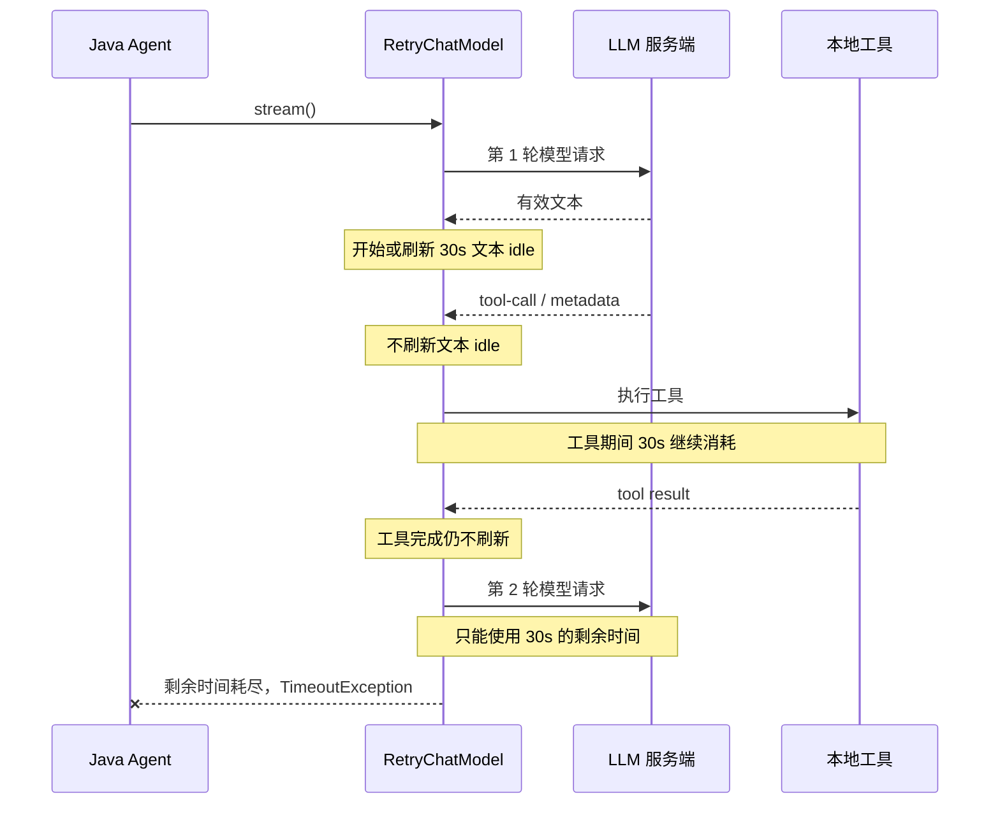
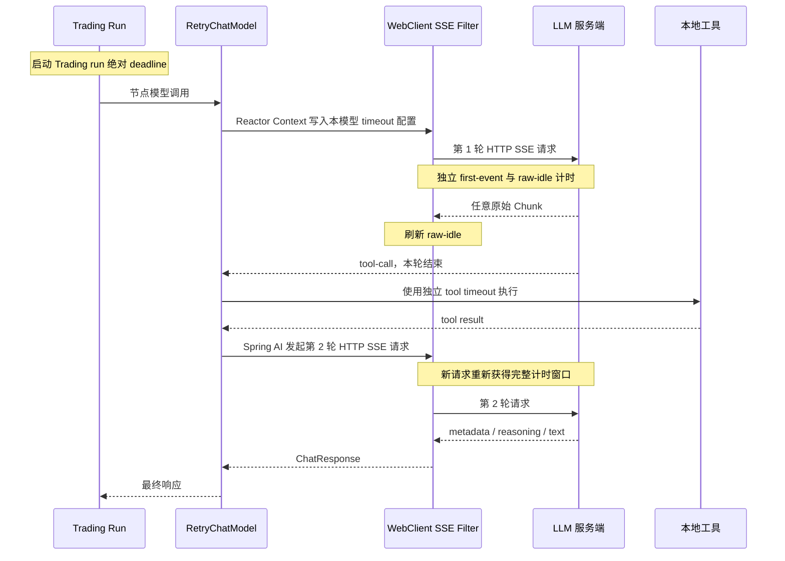

# 交易 Agent 分层超时与流式停顿治理设计

## 背景

交易分析中的 `AggressiveRiskAnalystNode` 和 `ConservativeRiskAnalystNode` 已经收到部分流式响应，并成功完成新浪新闻工具调用，但随后被 `RetryChatModel` 的 30 秒 idle timeout 终止。失败日志显示：

- 工具日志明确记录“新浪新闻搜索完成”，工具本身没有抛出 timeout。
- `StreamingChatResponseCollector` 已收到少量文本，随后以 `completionState=error` 结束。
- 根因是 Reactor `TimeoutException`，表示下游连续一段时间没有收到新的 `ChatResponse`。

当前 `RetryChatModel` 仅在收到非空文本时刷新 idle timer。tool-call、metadata、工具执行、工具结果组装和工具完成后的下一轮模型请求都不会刷新计时器。因此一个 30 秒窗口实际覆盖：

```text
最后一个有效文本
→ tool-call 收尾
→ 本地工具执行
→ tool result 组装
→ 下一轮模型请求排队和建连
→ 模型处理工具结果
→ 下一轮首个有效文本
```

这不是可靠的流失活判断，而是把“用户可见文本暂时停顿”错误地当成“底层 SSE 已经死亡”。

此外，现有配置中的 `totalTimeout=150s` 通过 Reactor `.timeout(Duration)` 实现。它限制的是相邻下游信号间隔，不是从调用开始计算的绝对总时长。交易层虽有每个节点独立的 `nodeTimeout=180s`，但整个 Trading Pipeline 没有共享的绝对截止时间。

## 设计结论

采用参考 Claude Code、并结合当前 Spring AI 1.1.2 调用结构的分层超时方案：

- 30 秒只作为流停顿观测阈值，不再终止请求。
- 每一轮原始 HTTP SSE 请求独立计算首事件 timeout 和 raw-chunk idle timeout。
- 本地交易工具使用独立 timeout，不占用 SSE idle 窗口。
- 每个 Trading 节点保留独立绝对 deadline。
- 整次 Trading run 新增共享绝对 deadline，所有 Stage 和节点共同消耗同一预算。
- 保留现有首响应前重试和上下文压缩逻辑。
- 不实现 `ATOMIC` 缓冲，也不在已经交付部分响应后重试整个模型调用。

上一版“交易 LLM 原子流式重试设计”以超时后的整体重试为主，没有修正 timeout 所在层级，并依赖普通 `ThreadLocal` 向交易工作线程传递模式。该设计不再采用并从仓库删除。

## 目标

- 工具调用期间不再消耗模型 SSE idle 时间。
- 工具完成后发起的下一轮模型请求获得完整的新一轮首事件窗口。
- 30 秒流停顿可以被观测，但不会制造误杀。
- 真正无任何网络数据的 SSE 连接能够被较长 watchdog 主动终止。
- 工具、模型轮次、节点和整次交易任务各自使用职责单一的 timeout。
- 超时能够取消对应层级的工作，禁止超时后的结果继续提交。
- 普通聊天和非工具流继续保持实时 Streaming，不引入整次响应缓冲。
- 配置迁移和 Spring AI 升级具有明确的兼容策略和契约测试。

## 非目标

- 不实现收到部分响应后的 `ATOMIC` 整体重试。
- 不持久化或复用工具结果。
- 不修改供应商服务端的排队、限流和推理策略。
- 不保证第三方阻塞调用一定响应 Java 线程中断；通过底层 HTTP timeout、专用有界执行器和晚提交隔离降低影响。
- 不在本阶段移除 legacy Trading Dispatcher，但默认同步 Pipeline 是完整 deadline 保证的主要路径。
- 不把“长时间没有用户可见文本”定义为协议错误。

## 方案比较

### 方案一：保留当前有效文本 idle，单纯扩大到 90 或 300 秒

实现最小，但工具执行和下一轮模型推理仍被错误地计入同一个文本窗口。该方案只能降低复现概率，无法修正超时边界，因此不采用。

### 方案二：只保留一个 300 秒原始 SSE idle

逻辑简单，适合底层传输存活判断，但工具 timeout、节点 deadline 和整次任务预算仍然缺失，故障定位也不够精确。该方案作为传输层原则使用，不单独采用。

### 方案三：分层超时与停顿观测

将原始 SSE、工具、节点和整次交易任务分别计时；30 秒停顿只用于观测，90 秒 raw idle 才终止单轮模型流。该方案同时解决误杀、资源失控和可观测性问题，因此采用。

## 当前链路



## 目标链路



## 超时模型

第一阶段采用以下默认值，全部支持配置：

| 层级 | 配置建议 | 计时起点 | 刷新或结束条件 | 超时行为 |
|---|---:|---|---|---|
| TCP 连接 | 10 秒 | 每次 HTTP 建连 | 连接成功 | 取消本次请求 |
| 首个 SSE 事件 | 45 秒 | 每轮模型 HTTP 请求发出 | 收到首个原始 DataBuffer | 抛出 `FirstStreamEventTimeoutException` |
| 流停顿观测 | 30 秒 | 收到首个原始 Chunk 后 | 下一原始 Chunk 到达 | 只记录 `llm_stream_stall`，不终止 |
| 原始 SSE idle | 90 秒 | 收到首个原始 Chunk后 | 任意原始 DataBuffer 到达 | 取消本轮请求并抛出 `RawStreamIdleTimeoutException` |
| 交易工具 | 60 秒 | 每次本地 tool callback 开始 | callback 返回 | 取消工具 Future，返回工具超时结果 |
| Trading 节点 | 180 秒 | 每个节点开始 | 节点提交或失败 | 取消节点 Future，禁止晚提交 |
| Trading run | 15 分钟 | 本次股票分析开始 | Pipeline 终止 | 取消活动节点，发送一次终止事件 |

约束关系：

```text
connect timeout < first-event timeout < raw-stream idle < node timeout < run timeout
```

实际执行时，子层预算不得超过父层剩余预算。节点 deadline 取以下两者的较小值：

```text
min(节点开始时间 + nodeTimeout, tradingRunDeadline)
```

工具调用同时受自己的 60 秒上限、节点 Future 取消和 Trading run 取消约束。

## 架构设计

### 原始 SSE 传输过滤器

新增 `SseTransportTimeoutFilter`，安装到 `AiClientHttpTimeoutConfig` 提供的专用 `WebClient.Builder`。过滤器工作在 Spring AI 把原始响应解码为 `ChatResponse` 之前，观察 `DataBuffer`，而不是有效文本。

过滤器职责：

- 从 Reactor Context 读取本次模型的 resolved timeout 配置。
- 从 HTTP 请求开始计算首事件 deadline，覆盖等待响应头和首个 body 数据的时间。
- 收到首个 DataBuffer 后关闭首事件计时。
- 每个 DataBuffer 都刷新 90 秒 raw idle watchdog，包括 SSE comment、metadata、tool-call 和文本数据。
- 相邻原始 Chunk 间隔超过 30 秒时，在下一 Chunk 到达后记录 stall 指标，不抛异常。
- 90 秒没有任何 DataBuffer 时取消当前 response body，并抛出明确的传输异常。
- 在 complete、error 和 cancel 路径清理 timer，不保留跨订阅共享状态。

`OpenAiChatModel.internalStream()` 会在工具返回后递归发起新的 `OpenAiApi.chatCompletionStream()`。每次调用都是新的 WebClient exchange，因此过滤器天然按模型轮次重新计时，工具执行阶段没有活动的 HTTP SSE，也就不会占用 SSE idle。

过滤器只安装在 `OpenAiApi` 使用的专用 WebClient 上，不影响 Redis、数据库、普通 HTTP Provider 或其他 WebClient。`AiClientApiNode` 对注入的 builder 使用 `clone()`，避免多个 API Bean 叠加重复 filter。

### Reactor Context 传递模型级配置

同一个 `OpenAiApi` 可能被多个模型共用，而 streaming timeout override 当前定义在模型配置上。因此不能把 timeout 固化在 API Bean 或共享 WebClient 实例中。

`RetryChatModel.stream()` 在每次订阅时通过 `contextWrite` 写入不可变的 `StreamTransportPolicy`：

```text
firstEventTimeout
rawIdleTimeout
stallThreshold
modelId 或本地 client 标识
logicalCallId
```

WebClient filter 通过 `deferContextual` 读取策略。Reactor Context 随 Spring AI 的递归 `internalStream()` 保留，且不依赖普通 `ThreadLocal` 跨 executor 传播。每次订阅拥有独立策略和计时状态。

### `RetryChatModel` 职责调整

`RetryChatModel` 保留：

- 首个模型响应之前的普通错误重试。
- 上下文溢出检测和 Prompt 压缩恢复。
- 模型调用安全上限和退避配置。
- 是否已经对下游交付响应的状态判断。

`RetryChatModel` 删除：

- 基于非空文本的 30 秒硬 timeout。
- 名为 `totalTimeout`、实际为相邻下游信号 timeout 的最外层 `.timeout(...)`。

收到 `FirstStreamEventTimeoutException` 或 `RawStreamIdleTimeoutException` 时，继续复用当前安全语义：

- 尚未向下游交付任何 `ChatResponse`：可按现有 `RetryConfig` 分类重试。
- 已经向下游交付任意响应：直接传播，不进行整次重试，避免重复内容和重复工具调用。

本设计不引入 `LIVE/ATOMIC` 模式，也不修改 `TradingLlmCallAudit`。

### 交易工具 timeout

在 `TradingToolCallbacks.AbstractToolCallback` 边界增加工具执行治理。工具的 `doExecute(...)` 提交到新的有界 `tradingToolExecutor`，不得复用正在等待工具结果的 `tradingTaskExecutor`，避免线程池自等待和饥饿。

执行规则：

- 每个工具默认最多执行 60 秒。
- Provider 自身的 connect/read timeout 必须小于工具总 timeout。
- 正常返回时记录 duration 和结果长度，不记录完整业务内容。
- 超时时调用 `Future.cancel(true)`，记录 `tool_execution_timeout`。
- timeout 转换为明确的工具错误字符串，由 Spring AI 作为 `ToolResponseMessage` 发回模型，让模型可以基于缺失数据继续生成，而不是直接杀死整个 Agent。
- 身份边界错误继续立即抛出，不得转换为普通工具结果。
- 执行器使用有界队列和拒绝策略；饱和时返回 `TOOL_EXECUTOR_SATURATED` 工具错误并记录指标。

如果第三方 SDK 或 Provider 不响应线程中断，晚返回结果必须被丢弃，不能覆盖已经发送给模型的 timeout 结果。专用有界线程池用于限制此类残留任务的影响面。

### Trading run 绝对 deadline

新增 `TradingRunScope`，由 `TradingStarter` 在创建 `TradingStateContext` 时创建并贯穿整个 Pipeline。默认 deadline 为开始时间加 15 分钟。

新增 `TradingRunCoordinator`，使用现有独立的 `tradingOrchestrationExecutor` 执行完整交易工作单元：

```text
股票数据加载
→ Trading Pipeline
→ 最终结果构建
→ 终止事件发送
```

`TradingStarter` 不再直接调用 `populateStockInfo(...)` 和 `tradingPipeline.execute(...)`，而是把完整工作单元提交给 Coordinator，并按 run 剩余预算等待。deadline 到达时，Coordinator 取消 orchestration Future，再由 run scope 取消其注册的活动节点。这样数据加载、Stage 间逻辑和最终提交也属于整次任务上限，而不是只在 Stage 边界被动检查。

`TradingRunScope` 包含：

- `startedAt` 和不可变 `deadline`。
- `RUNNING / TIMED_OUT / CANCELLED / COMPLETED` 状态。
- 当前活动节点 Future 的线程安全注册表。
- `remaining()`、`isExpired()` 和取消活动任务能力。
- 一次性终止信号，避免重复发送 SSE complete/error。

`TradingNodeInvoker.newScope(...)` 不再无条件创建完整的 180 秒窗口，而是使用 run 剩余预算计算节点 deadline。并行分析师任务同样注册到 run scope。

Pipeline 在以下边界检查 run scope：

- 股票数据加载前后。
- 每个 Stage 开始和结束。
- 每个节点提交前后。
- 最终报告发送前。

run deadline 到达时：

- 原子地把 run 标记为 `TIMED_OUT`。
- 取消注册的节点 Future 和当前流订阅。
- `NodeResultCommitter` 拒绝任何晚提交。
- 发送一次 `TRADING_RUN_TIMEOUT` 终止事件并关闭 SSE。
- 后续 Stage 不再开始。

正常完成、异常、客户端取消和 timeout 路径都必须在 `finally` 中注销 orchestration Future，并清理 deadline 定时任务。`TradingStarter.start(...)` 与 `startForSubTask(...)` 复用同一个 Coordinator，避免 SSE 和子任务路径产生不同的总时长语义。

默认同步 Pipeline 提供完整保证。legacy Dispatcher 的 latch 等待改为使用 run 剩余时间；超时后必须停止业务提交并终止 SSE。由于旧 Dispatcher 的 `CompletableFuture.orTimeout()` 本身不会取消底层任务，legacy 路径只提供提交隔离和 best-effort 取消，并记录迁移警告。

## 错误分类

| 错误 | 所属层级 | 是否重试 | 是否允许继续 |
|---|---|---|---|
| TCP/建连错误 | 单轮模型请求 | 首响应前按现有配置 | 否 |
| `FirstStreamEventTimeoutException` | 单轮模型请求 | 未交付响应时可重试 | 否 |
| `RawStreamIdleTimeoutException` | 单轮模型请求 | 未交付响应时可重试 | 否 |
| 30 秒 stall | 观测 | 不适用 | 是 |
| 工具 timeout | 单次工具 | 不由 `RetryChatModel` 重试 | 以错误 tool result 继续 |
| 节点 deadline | 单节点 | 不重试 | Pipeline 按节点不可用处理 |
| Trading run deadline | 整次任务 | 不重试 | 立即终止 Pipeline |
| 客户端断开 | 整次任务 | 不重试 | 立即取消 |
| 上下文溢出 | 模型调用 | 现有压缩恢复 | 预算内继续 |
| 结构化解析失败 | 业务层 | 不由模型层重试 | 按现有降级策略 |

## 配置与兼容性

建议的新配置：

```yaml
ai:
  client:
    streaming:
      timeout-mode: layered
      connect-timeout: 10s
      first-event-timeout: 45s
      stall-threshold: 30s
      raw-idle-timeout: 90s

spring:
  ai:
    trading:
      tool-timeout: 60s
      node-timeout: 180s
      run-timeout: 15m
```

兼容策略：

- 增加 `timeout-mode=legacy|layered` 作为短期发布开关；测试和预发先启用 `layered`，验证后生产切换，稳定一个版本后删除 legacy。
- 旧 `first-content-timeout` 在 layered 模式下作为 `first-event-timeout` 的 fallback，并记录一次弃用警告。
- 旧 `idle-timeout` 在 layered 模式下仅作为 `stall-threshold` 的 fallback，不再执行硬终止。
- 旧 `total-timeout` 和模型 JSON 中的 `totalTimeoutMs` 保持可反序列化，但 layered 模式不再用于流终止；配置非空时记录弃用警告。
- 模型 JSON 新增 `firstEventTimeoutMs`、`rawIdleTimeoutMs` 和 `stallThresholdMs`，新字段优先于旧字段。
- `TradingTimeoutPropertiesValidator` 改为验证 `nodeTimeout < runTimeout`，不再要求节点 timeout 大于旧 model total timeout。
- LIVE Streaming 的下游交付顺序保持不变，不增加缓冲。
- Spring AI 升级时必须运行工具递归与 Reactor Context 契约测试，防止内部 `internalStream()` 行为变化。

## 可观测性

新增结构化事件：

### `llm_stream_stall`

- `logicalCallId`
- `streamRequestId`
- `modelId`
- `stallDurationMs`
- `eventType`
- `roundSequence`

### `llm_stream_timeout`

- `timeoutType=FIRST_EVENT|RAW_IDLE`
- `configuredTimeoutMs`
- `elapsedMs`
- `receivedRawChunkCount`
- `deliveredChatResponseCount`
- `retryAttempt`

### `trading_tool_execution`

- `runId`
- `targetId`
- `toolName`
- `durationMs`
- `status=SUCCESS|TIMEOUT|FAILED|SATURATED|CANCELLED`

### `trading_run_observation`

- `runId`
- `targetId`
- `elapsedMs`
- `remainingMs`
- `terminalState`
- `activeNodeCount`
- `lastCompletedStage`

日志不得记录完整 Prompt、工具返回正文、API Key 或用户敏感信息。

## 测试策略

### 传输层测试

- 首个响应头或首个 DataBuffer 超过 45 秒，抛出 `FirstStreamEventTimeoutException`。
- 首个 Chunk 正常到达，之后间隔 35 秒再到达下一 Chunk，只记录 stall，不中断。
- 首个 Chunk 正常到达，之后 90 秒没有任何 DataBuffer，取消上游并抛出 `RawStreamIdleTimeoutException`。
- SSE comment、metadata、tool-call 和文本 DataBuffer 均刷新 raw idle。
- complete、error、cancel 后 timer 全部清理，无重复 timeout 回调。
- 同一个 WebClient 并发订阅使用独立状态和策略。

### Spring AI 工具循环契约测试

- 第 1 轮模型返回 tool-call，工具执行 40 秒，第 2 轮在 45 秒内返回首事件；整个调用成功，工具时间不计入 SSE idle。
- 工具完成后第 2 轮重新获得完整 first-event 窗口。
- 多次连续 tool-call 的每个模型轮次分别计时。
- Reactor Context 在 Spring AI 1.1.2 的递归 `internalStream()` 中保持可见。
- 工具返回 `returnDirect` 时不发起额外模型轮次，能够正常完成。

### `RetryChatModel` 回归测试

- 30 秒没有有效文本不再产生硬 timeout。
- 首响应前传输 timeout 继续按照现有配置重试。
- 已交付响应后的传输错误不重试。
- 上下文压缩调用继续受模型调用安全上限保护。
- 两次订阅和并发调用的 retry state、transport policy 完全隔离。

### 工具 timeout 测试

- 工具在 60 秒内完成，正常返回并记录成功事件。
- 工具 timeout 后取消 Future，只向模型返回一次 timeout 工具结果。
- timeout 后晚返回的工具结果被丢弃。
- executor 队列饱和时快速返回 SATURATED 工具错误。
- 身份边界异常继续向上传播，不转换为普通工具错误。

### Trading deadline 测试

- 单节点 deadline 为 `min(now+nodeTimeout, runDeadline)`。
- 顺序节点共同消耗 run budget，不会每个节点重新获得完整 run timeout。
- 并行分析师在 run timeout 时全部取消，并拒绝晚提交。
- run timeout、客户端取消和正常完成只产生一个终止事件。
- Pipeline 在 deadline 后不再启动下一 Stage。
- legacy latch 使用剩余预算，不再无限等待。

### 真实场景复测

- 使用原失败交易场景复测新浪新闻工具调用。
- 验证工具完成后第二轮模型请求有新的 `streamRequestId` 和完整 first-event 窗口。
- 验证原 30 秒位置仅产生 stall 日志，不产生节点 `EXECUTION_FAILED`。
- 模拟供应商真正无 raw Chunk，验证 90 秒 watchdog 能够取消连接。

## 推进顺序

1. 增加新配置结构、legacy/layered 开关和兼容解析测试。
2. 实现 WebClient 原始 SSE filter 与结构化 stall/timeout 日志。
3. 调整 `RetryChatModel`，移除文本硬 timeout 和伪 total timeout，保留重试与压缩。
4. 为交易工具增加专用有界执行器和独立 timeout。
5. 增加 `TradingRunScope`，让节点、Stage、提交和 SSE 共享绝对 deadline。
6. 完成 Spring AI 工具循环契约测试和交易场景回归。
7. 测试环境启用 `layered`，观察 stall、raw idle、工具耗时和 run 耗时分布。
8. 生产切换到 `layered`；稳定一个版本后删除 legacy timeout 路径和弃用配置。

## 风险与缓解

- **Spring AI 内部行为变化**：工具循环位于 `OpenAiChatModel.internalStream()`，版本升级可能改变 Reactor Context 或递归方式。通过真实 ChatClient 契约测试锁定。
- **DataBuffer 资源泄漏**：timeout 和 cancel 必须取消上游并由 WebClient 释放 body；增加 cancel/内存回归测试。
- **工具线程残留**：部分第三方调用不响应 interrupt。使用 Provider 底层 timeout、专用有界执行器和晚结果丢弃降低影响。
- **运行时长增加**：移除 30 秒误杀后，慢请求可能运行更久。90 秒 raw idle、180 秒节点 deadline 和 15 分钟 run deadline 构成上限。
- **配置语义变化**：旧 idle/total 字段不再保持原硬超时语义。通过显式 mode、启动弃用日志和分阶段切换控制。
- **legacy Dispatcher 取消不彻底**：默认同步 Pipeline 提供完整保证；legacy 路径记录告警并仅做 best-effort 取消，后续单独移除。

## 成功标准

- 工具执行成功后，不会因为工具耗时占用了旧 30 秒文本 idle 而误杀。
- 每轮模型 HTTP SSE 请求独立计算首事件和 raw idle。
- 30 秒 stall 只产生观测事件，不改变业务结果。
- 真正无原始 Chunk 的流在 90 秒内被取消并分类为传输 timeout。
- 工具、节点和 Trading run 均有独立且可观测的 deadline。
- 整次交易分析不会无限运行，超时后不会提交晚结果或重复发送终止事件。
- 普通聊天 Streaming、现有首响应前重试和上下文压缩保持兼容。
- 原失败日志对应的交易场景能够完成，或以准确的传输、工具、节点、run timeout 分类失败。
